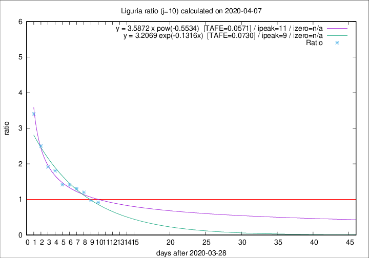
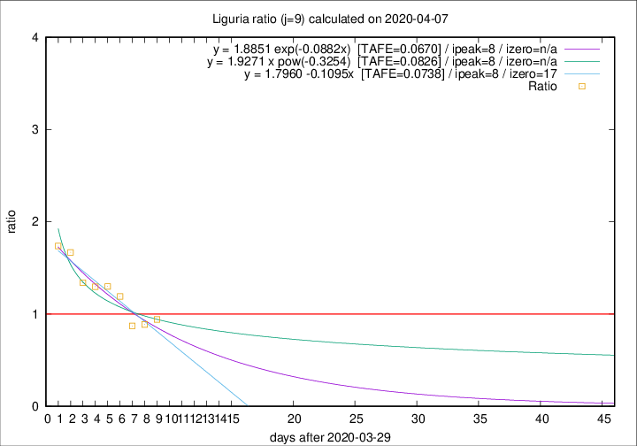

# Liguria

Data source: https://raw.githubusercontent.com/pcm-dpc/COVID-19/master/dati-json/dpc-covid19-ita-regioni.json

Estimates in this page were made on 8/4/2020 with data available until 07/04/2020.

## Summary 

### Peak estimate 
|j|linear [TAFE]|exponential [TAFE]|power law [TAFE]|details|
|---|----|-----------|---------|-------|
|7|5/4/2020 [TAFE=0.0948]|5/4/2020 [TAFE=0.0944]|4/4/2020 [TAFE=0.0830]|[analysis](COVID-19_liguria_j7_2020-04-07.md)|
|8|6/4/2020 [TAFE=0.0894]|6/4/2020 [TAFE=0.0893]|6/4/2020 [TAFE=0.0947]|[analysis](COVID-19_liguria_j8_2020-04-07.md)|
|9|7/4/2020 [TAFE=0.0738]|7/4/2020 [TAFE=0.0670]|7/4/2020 [TAFE=0.0826]|[analysis](COVID-19_liguria_j9_2020-04-07.md)|
|10|7/4/2020 [TAFE=0.1399]|7/4/2020 [TAFE=0.0730]|9/4/2020 [TAFE=0.0571]|[analysis](COVID-19_liguria_j10_2020-04-07.md)|
|11|7/4/2020 [TAFE=0.2193]|8/4/2020 [TAFE=0.0907]|12/4/2020 [TAFE=0.0910]|[analysis](COVID-19_liguria_j11_2020-04-07.md)|
|12|7/4/2020 [TAFE=0.2707]|9/4/2020 [TAFE=0.0831]|16/4/2020 [TAFE=0.1303]|[analysis](COVID-19_liguria_j12_2020-04-07.md)|
|13|7/4/2020 [TAFE=0.3641]|10/4/2020 [TAFE=0.0717]|20/4/2020 [TAFE=0.1791]|[analysis](COVID-19_liguria_j13_2020-04-07.md)|
|14|6/4/2020 [TAFE=0.6538]|10/4/2020 [TAFE=0.0889]|23/4/2020 [TAFE=0.2147]|[analysis](COVID-19_liguria_j14_2020-04-07.md)|

Best estimator is pow with j=10 (TAFE=0.0571)
Corresponding peak date estimate is 9/4/2020 (ipeak 11)

Peak date range estimate: 1/4/2020 - 27/4/2020

### End estimate 
|j|linear [TAFE/TFE]|exponential [TAFE/TFE]|power law [TAFE/TFE]|details|
|---|----|-----------|---------|-------|
|7|24/5/2020 [TAFE=0.0948]|-|-|[analysis](COVID-19_liguria_j7_2020-04-07.md)|
|8|25/4/2020 [TAFE=0.0894]|-|-|[analysis](COVID-19_liguria_j8_2020-04-07.md)|
|9|16/4/2020 [TAFE=0.0738]|-|-|[analysis](COVID-19_liguria_j9_2020-04-07.md)|
|10|-|-|-|[analysis](COVID-19_liguria_j10_2020-04-07.md)|
|11|-|-|-|[analysis](COVID-19_liguria_j11_2020-04-07.md)|
|12|-|-|-|[analysis](COVID-19_liguria_j12_2020-04-07.md)|
|13|-|-|-|[analysis](COVID-19_liguria_j13_2020-04-07.md)|
|14|-|-|-|[analysis](COVID-19_liguria_j14_2020-04-07.md)|

Best estimator is linear with j=9 (TAFE=0.0738)
Corresponding end date estimate is 16/4/2020 (izero 17)

End date range estimate: 30/3/2020 - 22/5/2020

Generated April 8th, 2020 at 23:43:36 UTC+0200 with https://github.com/robianc/COVID-19
