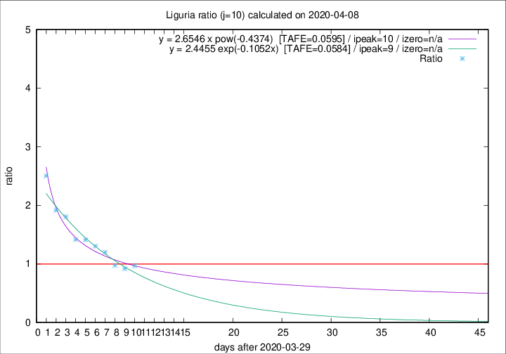

# Liguria

Data source: https://raw.githubusercontent.com/pcm-dpc/COVID-19/master/dati-json/dpc-covid19-ita-regioni.json

Delta days analysis (j): 10

## Fitting 
|fit type|best fit equation|tafe|tfe|ipeak|izero|
|-------|-----|--------|------|---|---|
|exp|y = 2.4455 exp(-0.1052x)  [TAFE=0.0584]|0.0584|0.0028|9|n/a|
|pow|y = 2.6546 x pow(-0.4374)  [TAFE=0.0595]|0.0595|0.0022|10|n/a|

## Data
|Date|Daily deaths|Cumulated deaths|Deaths in the last 10 days|Deaths in the 10 days before|ratio|
|----|----------|-----------|-------|--------------------|-----|
|2020-04-08|34|654|277|286|0.9685|
|2020-04-07|25|620|262|285|0.9193|
|2020-04-06|39|595|264|271|0.9742|
|2020-04-05|14|556|276|230|1.2000|
|2020-04-04|23|542|288|221|1.3032|
|2020-04-03|31|519|288|204|1.4118|
|2020-04-02|28|488|276|195|1.4154|
|2020-04-01|32|460|289|160|1.8062|
|2020-03-31|31|428|276|144|1.9167|
|2020-03-30|20|397|278|111|2.5045|

[Download data as CSV](COVID-19_liguria_j10_2020-04-08.csv)

Generated April 8th, 2020 at 23:43:36 UTC+0200 with https://github.com/robianc/COVID-19
