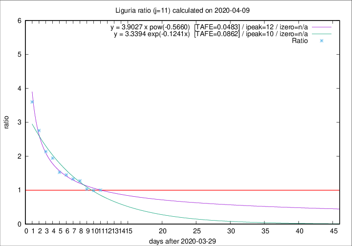

# Liguria

Data source: https://raw.githubusercontent.com/pcm-dpc/COVID-19/master/dati-json/dpc-covid19-ita-regioni.json

Delta days analysis (j): 11

Analyses for other values of j for 2020-04-09 are avalable [here](../2020-04-09/README.md)

Analyses for Liguria for previous dates are avalable [here](../README.md)

## Fitting 
|fit type|best fit equation|tafe|tfe|ipeak|izero|
|-------|-----|--------|------|---|---|
|exp|y = 3.3394 exp(-0.1241x)  [TAFE=0.0862]|0.0862|0.0054|10|n/a|
|pow|y = 3.9027 x pow(-0.5660)  [TAFE=0.0483]|0.0483|0.0016|12|n/a|

## Data
|Date|Daily deaths|Cumulated deaths|Deaths in the last 11 days|Deaths in the 11 days before|ratio|
|----|----------|-----------|-------|--------------------|-----|
|2020-04-09|28|682|305|304|1.0033|
|2020-04-08|34|654|296|298|0.9933|
|2020-04-07|25|620|289|281|1.0285|
|2020-04-06|39|595|315|247|1.2753|
|2020-04-05|14|556|302|227|1.3304|
|2020-04-04|23|542|311|214|1.4533|
|2020-04-03|31|519|307|201|1.5274|
|2020-04-02|28|488|317|163|1.9448|
|2020-04-01|32|460|308|144|2.1389|
|2020-03-31|31|428|309|112|2.7589|
|2020-03-30|20|397|306|85|3.6000|

[Download data as CSV](COVID-19_liguria_j11_2020-04-09.csv)

Generated April 12th, 2020 at 17:02:01 UTC+0200 with https://github.com/robianc/COVID-19
