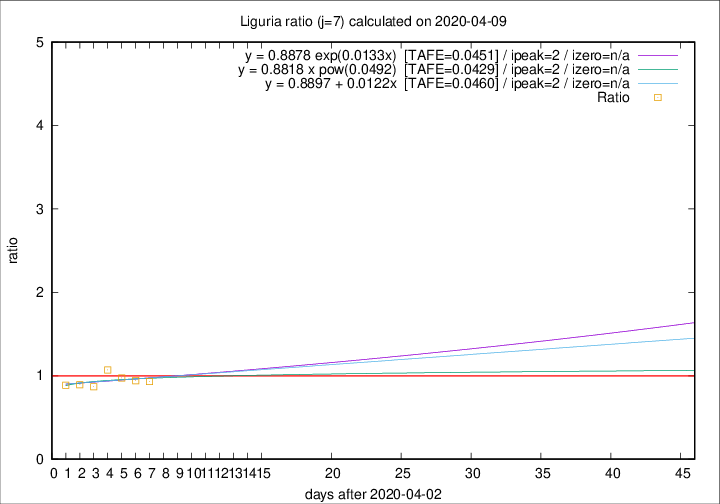

# Liguria

Data source: https://raw.githubusercontent.com/pcm-dpc/COVID-19/master/dati-json/dpc-covid19-ita-regioni.json

Delta days analysis (j): 7

Analyses for other values of j for 2020-04-09 are avalable [here](../2020-04-09/README.md)

Analyses for Liguria for previous dates are avalable [here](../README.md)

## Fitting 
|fit type|best fit equation|tafe|tfe|ipeak|izero|
|-------|-----|--------|------|---|---|
|linear|y = 0.8897 + 0.0122x  [TAFE=0.0460]|0.0460|0.0038|2|n/a|
|exp|y = 0.8878 exp(0.0133x)  [TAFE=0.0451]|0.0451|0.0018|2|n/a|
|pow|y = 0.8818 x pow(0.0492)  [TAFE=0.0429]|0.0429|0.0016|2|n/a|

## Data
|Date|Daily deaths|Cumulated deaths|Deaths in the last 7 days|Deaths in the 7 days before|ratio|
|----|----------|-----------|-------|--------------------|-----|
|2020-04-09|28|682|194|208|0.9327|
|2020-04-08|34|654|194|206|0.9417|
|2020-04-07|25|620|192|197|0.9746|
|2020-04-06|39|595|198|185|1.0703|
|2020-04-05|14|556|179|206|0.8689|
|2020-04-04|23|542|184|206|0.8932|
|2020-04-03|31|519|188|212|0.8868|

[Download data as CSV](COVID-19_liguria_j7_2020-04-09.csv)

Generated April 12th, 2020 at 17:02:01 UTC+0200 with https://github.com/robianc/COVID-19
