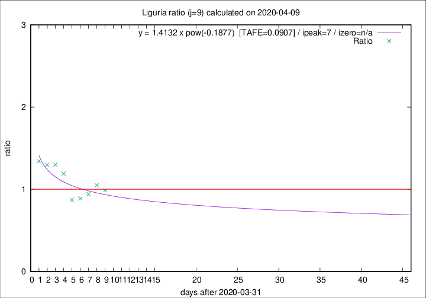

# Liguria

Data source: https://raw.githubusercontent.com/pcm-dpc/COVID-19/master/dati-json/dpc-covid19-ita-regioni.json

Delta days analysis (j): 9

## Fitting 
|fit type|best fit equation|tafe|tfe|ipeak|izero|
|-------|-----|--------|------|---|---|
|pow|y = 1.4132 x pow(-0.1877)  [TAFE=0.0907]|0.0907|0.0050|7|n/a|

## Data
|Date|Daily deaths|Cumulated deaths|Deaths in the last 9 days|Deaths in the 9 days before|ratio|
|----|----------|-----------|-------|--------------------|-----|
|2020-04-09|28|682|254|257|0.9883|
|2020-04-08|34|654|257|245|1.0490|
|2020-04-07|25|620|243|258|0.9419|
|2020-04-06|39|595|237|267|0.8876|
|2020-04-05|14|556|225|258|0.8721|
|2020-04-04|23|542|262|220|1.1909|
|2020-04-03|31|519|265|204|1.2990|
|2020-04-02|28|488|257|198|1.2980|
|2020-04-01|32|460|248|185|1.3405|

[Download data as CSV](COVID-19_liguria_j9_2020-04-09.csv)

Generated April 9th, 2020 at 16:40:48 UTC+0200 with https://github.com/robianc/COVID-19
