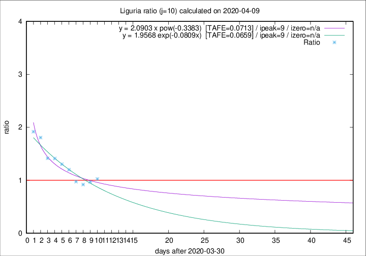

# Liguria

Data source: https://raw.githubusercontent.com/pcm-dpc/COVID-19/master/dati-json/dpc-covid19-ita-regioni.json

Estimates in this page were made on 10/4/2020 with data available until 09/04/2020.

## Summary 

### Peak estimate 
|j|linear [TAFE]|exponential [TAFE]|power law [TAFE]|details|
|---|----|-----------|---------|-------|
|7|5/4/2020 [TAFE=0.0460]|5/4/2020 [TAFE=0.0451]|5/4/2020 [TAFE=0.0429]|[analysis](COVID-19_liguria_j7_2020-04-09.md)|
|8|7/4/2020 [TAFE=0.0953]|7/4/2020 [TAFE=0.0944]|6/4/2020 [TAFE=0.0848]|[analysis](COVID-19_liguria_j8_2020-04-09.md)|
|9|8/4/2020 [TAFE=0.0958]|8/4/2020 [TAFE=0.0942]|8/4/2020 [TAFE=0.0907]|[analysis](COVID-19_liguria_j9_2020-04-09.md)|
|10|9/4/2020 [TAFE=0.0891]|9/4/2020 [TAFE=0.0659]|9/4/2020 [TAFE=0.0713]|[analysis](COVID-19_liguria_j10_2020-04-09.md)|
|11|9/4/2020 [TAFE=0.1547]|9/4/2020 [TAFE=0.0862]|11/4/2020 [TAFE=0.0483]|[analysis](COVID-19_liguria_j11_2020-04-09.md)|
|12|9/4/2020 [TAFE=0.2390]|10/4/2020 [TAFE=0.0923]|13/4/2020 [TAFE=0.1001]|[analysis](COVID-19_liguria_j12_2020-04-09.md)|
|13|9/4/2020 [TAFE=0.3098]|11/4/2020 [TAFE=0.0876]|17/4/2020 [TAFE=0.1386]|[analysis](COVID-19_liguria_j13_2020-04-09.md)|
|14|8/4/2020 [TAFE=0.4671]|11/4/2020 [TAFE=0.0994]|21/4/2020 [TAFE=0.1621]|[analysis](COVID-19_liguria_j14_2020-04-09.md)|

Best estimator is pow with j=7 (TAFE=0.0429)
Corresponding peak date estimate is 5/4/2020 (ipeak 2)

Peak date range estimate: 5/4/2020 - 28/4/2020

### End estimate 
|j|linear [TAFE/TFE]|exponential [TAFE/TFE]|power law [TAFE/TFE]|details|
|---|----|-----------|---------|-------|
|7|-|-|-|[analysis](COVID-19_liguria_j7_2020-04-09.md)|
|8|26/5/2020 [TAFE=0.0953]|-|-|[analysis](COVID-19_liguria_j8_2020-04-09.md)|
|9|-|-|-|[analysis](COVID-19_liguria_j9_2020-04-09.md)|
|10|18/4/2020 [TAFE=0.0891]|-|-|[analysis](COVID-19_liguria_j10_2020-04-09.md)|
|11|-|-|-|[analysis](COVID-19_liguria_j11_2020-04-09.md)|
|12|-|-|-|[analysis](COVID-19_liguria_j12_2020-04-09.md)|
|13|-|-|-|[analysis](COVID-19_liguria_j13_2020-04-09.md)|
|14|-|-|-|[analysis](COVID-19_liguria_j14_2020-04-09.md)|

Best estimator is linear with j=10 (TAFE=0.0891)
Corresponding end date estimate is 18/4/2020 (izero 18)

End date range estimate: 31/3/2020 - 24/5/2020

Generated April 10th, 2020 at 17:26:10 UTC+0200 with https://github.com/robianc/COVID-19
