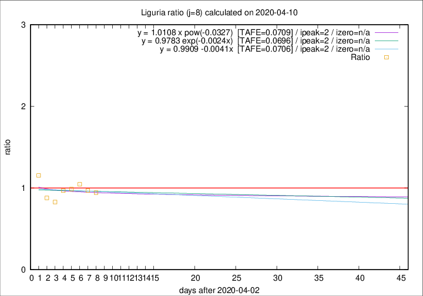

# Liguria

Data source: https://raw.githubusercontent.com/pcm-dpc/COVID-19/master/dati-json/dpc-covid19-ita-regioni.json

Delta days analysis (j): 8

Analyses for other values of j for 2020-04-10 are avalable [here](../2020-04-10/README.md)

Analyses for Liguria for previous dates are avalable [here](../README.md)

## Fitting 
|fit type|best fit equation|tafe|tfe|ipeak|izero|
|-------|-----|--------|------|---|---|
|linear|y = 0.9909 -0.0041x  [TAFE=0.0706]|0.0706|0.0092|2|n/a|
|exp|y = 0.9783 exp(-0.0024x)  [TAFE=0.0696]|0.0696|0.0044|2|n/a|
|pow|y = 1.0108 x pow(-0.0327)  [TAFE=0.0709]|0.0709|0.0043|2|n/a|

## Data
|Date|Daily deaths|Cumulated deaths|Deaths in the last 8 days|Deaths in the 8 days before|ratio|
|----|----------|-----------|-------|--------------------|-----|
|2020-04-10|27|709|221|234|0.9444|
|2020-04-09|28|682|222|229|0.9694|
|2020-04-08|34|654|226|216|1.0463|
|2020-04-07|25|620|223|226|0.9867|
|2020-04-06|39|595|218|225|0.9689|
|2020-04-05|14|556|198|239|0.8285|
|2020-04-04|23|542|211|240|0.8792|
|2020-04-03|31|519|239|207|1.1546|

[Download data as CSV](COVID-19_liguria_j8_2020-04-10.csv)

Generated April 16th, 2020 at 20:09:19 UTC+0200 with https://github.com/robianc/COVID-19
