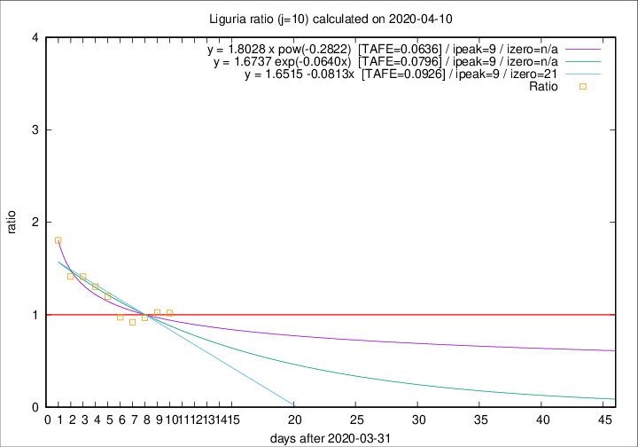

# Liguria

Data source: https://raw.githubusercontent.com/pcm-dpc/COVID-19/master/dati-json/dpc-covid19-ita-regioni.json

Estimates in this page were made on 12/4/2020 with data available until 10/04/2020.

## Summary 

### Peak estimate 
|j|linear [TAFE]|exponential [TAFE]|power law [TAFE]|details|
|---|----|-----------|---------|-------|
|7|6/4/2020 [TAFE=0.0477]|6/4/2020 [TAFE=0.0471]|6/4/2020 [TAFE=0.0438]|[analysis](COVID-19_liguria_j7_2020-04-10.md)|
|8|-|-|5/4/2020 [TAFE=0.0709]|[analysis](COVID-19_liguria_j8_2020-04-10.md)|
|9|9/4/2020 [TAFE=0.1056]|9/4/2020 [TAFE=0.1041]|8/4/2020 [TAFE=0.0864]|[analysis](COVID-19_liguria_j9_2020-04-10.md)|
|10|10/4/2020 [TAFE=0.0926]|10/4/2020 [TAFE=0.0796]|10/4/2020 [TAFE=0.0636]|[analysis](COVID-19_liguria_j10_2020-04-10.md)|
|11|10/4/2020 [TAFE=0.1192]|10/4/2020 [TAFE=0.0779]|11/4/2020 [TAFE=0.0482]|[analysis](COVID-19_liguria_j11_2020-04-10.md)|
|12|10/4/2020 [TAFE=0.2085]|10/4/2020 [TAFE=0.0996]|13/4/2020 [TAFE=0.0758]|[analysis](COVID-19_liguria_j12_2020-04-10.md)|
|13|10/4/2020 [TAFE=0.2605]|11/4/2020 [TAFE=0.0860]|16/4/2020 [TAFE=0.1364]|[analysis](COVID-19_liguria_j13_2020-04-10.md)|
|14|10/4/2020 [TAFE=0.3890]|12/4/2020 [TAFE=0.0921]|20/4/2020 [TAFE=0.1573]|[analysis](COVID-19_liguria_j14_2020-04-10.md)|

Best estimator is pow with j=7 (TAFE=0.0438)
Corresponding peak date estimate is 6/4/2020 (ipeak 2)

Peak date range estimate: 4/4/2020 - 27/4/2020

### End estimate 
|j|linear [TAFE/TFE]|exponential [TAFE/TFE]|power law [TAFE/TFE]|details|
|---|----|-----------|---------|-------|
|7|-|-|-|[analysis](COVID-19_liguria_j7_2020-04-10.md)|
|8|-|-|-|[analysis](COVID-19_liguria_j8_2020-04-10.md)|
|9|5/5/2020 [TAFE=0.1056]|-|-|[analysis](COVID-19_liguria_j9_2020-04-10.md)|
|10|22/4/2020 [TAFE=0.0926]|-|-|[analysis](COVID-19_liguria_j10_2020-04-10.md)|
|11|-|-|-|[analysis](COVID-19_liguria_j11_2020-04-10.md)|
|12|-|-|-|[analysis](COVID-19_liguria_j12_2020-04-10.md)|
|13|-|-|-|[analysis](COVID-19_liguria_j13_2020-04-10.md)|
|14|-|-|-|[analysis](COVID-19_liguria_j14_2020-04-10.md)|

Best estimator is linear with j=10 (TAFE=0.0926)
Corresponding end date estimate is 22/4/2020 (izero 21)

End date range estimate: 1/4/2020 - 4/5/2020

Generated April 12th, 2020 at 17:02:01 UTC+0200 with https://github.com/robianc/COVID-19
