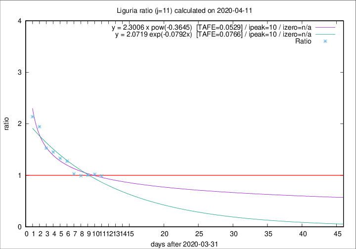

# Liguria

Data source: https://raw.githubusercontent.com/pcm-dpc/COVID-19/master/dati-json/dpc-covid19-ita-regioni.json

Delta days analysis (j): 11

Analyses for other values of j for 2020-04-11 are avalable [here](../2020-04-11/README.md)

Analyses for Liguria for previous dates are avalable [here](../README.md)

## Fitting 
|fit type|best fit equation|tafe|tfe|ipeak|izero|
|-------|-----|--------|------|---|---|
|exp|y = 2.0719 exp(-0.0792x)  [TAFE=0.0766]|0.0766|0.0039|10|n/a|
|pow|y = 2.3006 x pow(-0.3645)  [TAFE=0.0529]|0.0529|0.0017|10|n/a|

## Data
|Date|Daily deaths|Cumulated deaths|Deaths in the last 11 days|Deaths in the 11 days before|ratio|
|----|----------|-----------|-------|--------------------|-----|
|2020-04-11|25|734|306|309|0.9903|
|2020-04-10|27|709|312|306|1.0196|
|2020-04-09|28|682|305|304|1.0033|
|2020-04-08|34|654|296|298|0.9933|
|2020-04-07|25|620|289|281|1.0285|
|2020-04-06|39|595|315|247|1.2753|
|2020-04-05|14|556|302|227|1.3304|
|2020-04-04|23|542|311|214|1.4533|
|2020-04-03|31|519|307|201|1.5274|
|2020-04-02|28|488|317|163|1.9448|
|2020-04-01|32|460|308|144|2.1389|

[Download data as CSV](COVID-19_liguria_j11_2020-04-11.csv)

Generated April 19th, 2020 at 18:42:39 UTC+0200 with https://github.com/robianc/COVID-19
