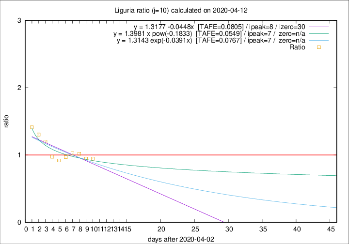

# Liguria

Data source: https://raw.githubusercontent.com/pcm-dpc/COVID-19/master/dati-json/dpc-covid19-ita-regioni.json

Delta days analysis (j): 10

Analyses for other values of j for 2020-04-12 are avalable [here](../README.md)

Analyses for Liguria for previous dates are avalable [here](../../README.md)

## Fitting 
|fit type|best fit equation|tafe|tfe|ipeak|izero|
|-------|-----|--------|------|---|---|
|linear|y = 1.3177 -0.0448x  [TAFE=0.0805]|0.0805|0.0077|8|30|
|exp|y = 1.3143 exp(-0.0391x)  [TAFE=0.0767]|0.0767|0.0039|7|n/a|
|pow|y = 1.3981 x pow(-0.1833)  [TAFE=0.0549]|0.0549|0.0020|7|n/a|

## Data
|Date|Daily deaths|Cumulated deaths|Deaths in the last 10 days|Deaths in the 10 days before|ratio|
|----|----------|-----------|-------|--------------------|-----|
|2020-04-12|15|749|261|276|0.9457|
|2020-04-11|25|734|274|289|0.9481|
|2020-04-10|27|709|281|276|1.0181|
|2020-04-09|28|682|285|278|1.0252|
|2020-04-08|34|654|277|286|0.9685|
|2020-04-07|25|620|262|285|0.9193|
|2020-04-06|39|595|264|271|0.9742|
|2020-04-05|14|556|276|230|1.2000|
|2020-04-04|23|542|288|221|1.3032|
|2020-04-03|31|519|288|204|1.4118|

[Download data as CSV](COVID-19_liguria_j10_2020-04-12.csv)

Generated April 12th, 2020 at 16:28:18 UTC+0200 with https://github.com/robianc/COVID-19
