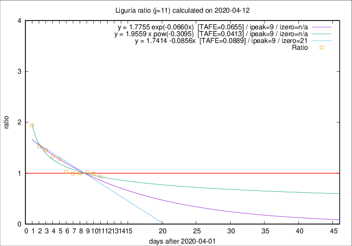
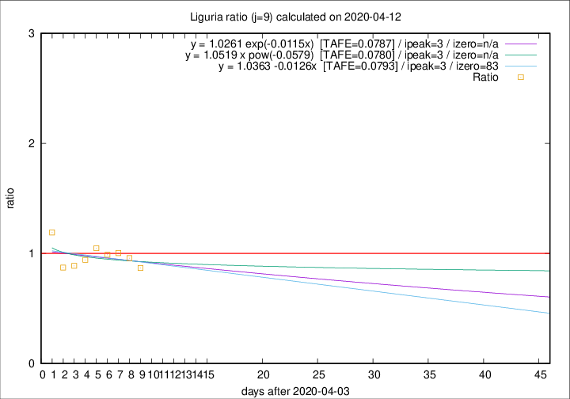

# Liguria

Data source: https://raw.githubusercontent.com/pcm-dpc/COVID-19/master/dati-json/dpc-covid19-ita-regioni.json

Estimates in this page were made on 19/4/2020 with data available until 12/04/2020.

## Summary 

### Peak estimate 
|j|linear [TAFE]|exponential [TAFE]|power law [TAFE]|details|
|---|----|-----------|---------|-------|
|7|8/4/2020 [TAFE=0.0437]|8/4/2020 [TAFE=0.0434]|-|[analysis](COVID-19_liguria_j7_2020-04-12.md)|
|8|7/4/2020 [TAFE=0.0509]|7/4/2020 [TAFE=0.0515]|7/4/2020 [TAFE=0.0485]|[analysis](COVID-19_liguria_j8_2020-04-12.md)|
|9|7/4/2020 [TAFE=0.0793]|7/4/2020 [TAFE=0.0787]|7/4/2020 [TAFE=0.0780]|[analysis](COVID-19_liguria_j9_2020-04-12.md)|
|10|11/4/2020 [TAFE=0.0805]|10/4/2020 [TAFE=0.0767]|10/4/2020 [TAFE=0.0549]|[analysis](COVID-19_liguria_j10_2020-04-12.md)|
|11|11/4/2020 [TAFE=0.0889]|11/4/2020 [TAFE=0.0655]|11/4/2020 [TAFE=0.0413]|[analysis](COVID-19_liguria_j11_2020-04-12.md)|
|12|11/4/2020 [TAFE=0.1439]|12/4/2020 [TAFE=0.0897]|13/4/2020 [TAFE=0.0448]|[analysis](COVID-19_liguria_j12_2020-04-12.md)|
|13|11/4/2020 [TAFE=0.2421]|12/4/2020 [TAFE=0.1099]|15/4/2020 [TAFE=0.0715]|[analysis](COVID-19_liguria_j13_2020-04-12.md)|
|14|11/4/2020 [TAFE=0.2835]|13/4/2020 [TAFE=0.0926]|18/4/2020 [TAFE=0.1321]|[analysis](COVID-19_liguria_j14_2020-04-12.md)|

Best estimator is pow with j=11 (TAFE=0.0413)
Corresponding peak date estimate is 11/4/2020 (ipeak 9)

Peak date range estimate: 2/4/2020 - 21/4/2020

### End estimate 
|j|linear [TAFE/TFE]|exponential [TAFE/TFE]|power law [TAFE/TFE]|details|
|---|----|-----------|---------|-------|
|7|-|-|-|[analysis](COVID-19_liguria_j7_2020-04-12.md)|
|8|-|-|-|[analysis](COVID-19_liguria_j8_2020-04-12.md)|
|9|26/6/2020 [TAFE=0.0793]|-|-|[analysis](COVID-19_liguria_j9_2020-04-12.md)|
|10|-|-|-|[analysis](COVID-19_liguria_j10_2020-04-12.md)|
|11|-|-|-|[analysis](COVID-19_liguria_j11_2020-04-12.md)|
|12|-|-|-|[analysis](COVID-19_liguria_j12_2020-04-12.md)|
|13|-|-|-|[analysis](COVID-19_liguria_j13_2020-04-12.md)|
|14|-|-|-|[analysis](COVID-19_liguria_j14_2020-04-12.md)|

Best estimator is linear with j=9 (TAFE=0.0793)
Corresponding end date estimate is 26/6/2020 (izero 83)

End date range estimate: 4/4/2020 - 26/6/2020

Generated April 19th, 2020 at 18:42:39 UTC+0200 with https://github.com/robianc/COVID-19
