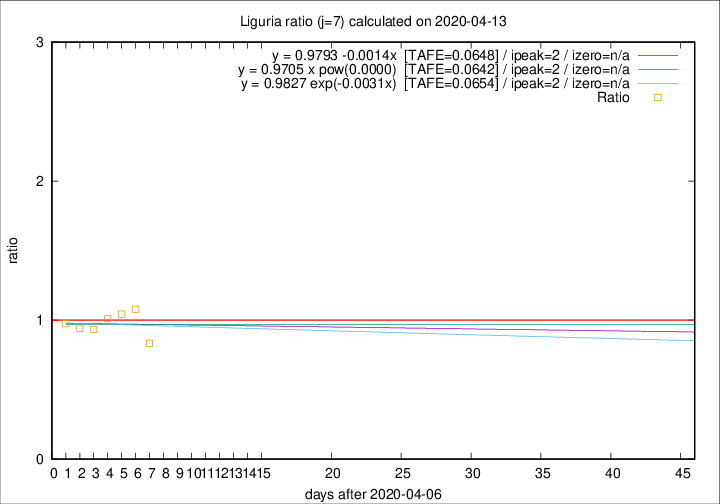

# Liguria

Data source: https://raw.githubusercontent.com/pcm-dpc/COVID-19/master/dati-json/dpc-covid19-ita-regioni.json

Delta days analysis (j): 7

Analyses for other values of j for 2020-04-13 are avalable [here](../2020-04-13/README.md)

Analyses for Liguria for previous dates are avalable [here](../README.md)

## Fitting 
|fit type|best fit equation|tafe|tfe|ipeak|izero|
|-------|-----|--------|------|---|---|
|linear|y = 0.9793 -0.0014x  [TAFE=0.0648]|0.0648|0.0064|2|n/a|
|exp|y = 0.9827 exp(-0.0031x)  [TAFE=0.0654]|0.0654|0.0032|2|n/a|
|pow|y = 0.9705 x pow(0.0000)  [TAFE=0.0642]|0.0642|0.0031|2|n/a|

## Data
|Date|Daily deaths|Cumulated deaths|Deaths in the last 7 days|Deaths in the 7 days before|ratio|
|----|----------|-----------|-------|--------------------|-----|
|2020-04-13|11|760|165|198|0.8333|
|2020-04-12|15|749|193|179|1.0782|
|2020-04-11|25|734|192|184|1.0435|
|2020-04-10|27|709|190|188|1.0106|
|2020-04-09|28|682|194|208|0.9327|
|2020-04-08|34|654|194|206|0.9417|
|2020-04-07|25|620|192|197|0.9746|

[Download data as CSV](COVID-19_liguria_j7_2020-04-13.csv)

Generated April 16th, 2020 at 20:09:19 UTC+0200 with https://github.com/robianc/COVID-19
