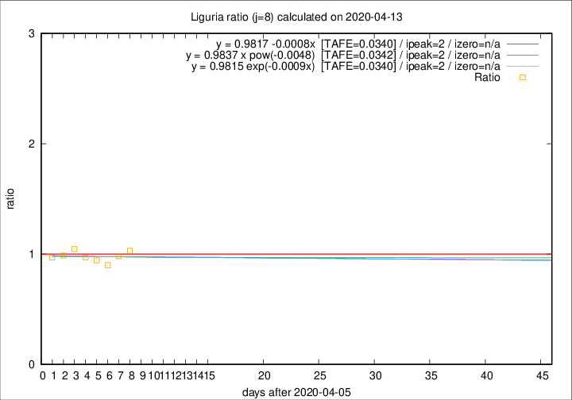
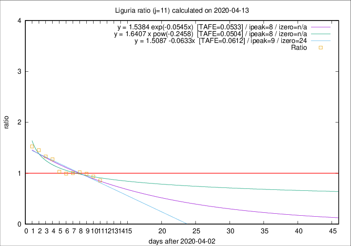

# Liguria

Data source: https://raw.githubusercontent.com/pcm-dpc/COVID-19/master/dati-json/dpc-covid19-ita-regioni.json

Estimates in this page were made on 19/4/2020 with data available until 13/04/2020.

## Summary 

### Peak estimate 
|j|linear [TAFE]|exponential [TAFE]|power law [TAFE]|details|
|---|----|-----------|---------|-------|
|7|9/4/2020 [TAFE=0.0648]|9/4/2020 [TAFE=0.0654]|9/4/2020 [TAFE=0.0642]|[analysis](COVID-19_liguria_j7_2020-04-13.md)|
|8|8/4/2020 [TAFE=0.0340]|8/4/2020 [TAFE=0.0340]|8/4/2020 [TAFE=0.0342]|[analysis](COVID-19_liguria_j8_2020-04-13.md)|
|9|7/4/2020 [TAFE=0.0653]|7/4/2020 [TAFE=0.0655]|7/4/2020 [TAFE=0.0641]|[analysis](COVID-19_liguria_j9_2020-04-13.md)|
|10|10/4/2020 [TAFE=0.0697]|10/4/2020 [TAFE=0.0697]|9/4/2020 [TAFE=0.0588]|[analysis](COVID-19_liguria_j10_2020-04-13.md)|
|11|12/4/2020 [TAFE=0.0612]|11/4/2020 [TAFE=0.0533]|11/4/2020 [TAFE=0.0504]|[analysis](COVID-19_liguria_j11_2020-04-13.md)|
|12|12/4/2020 [TAFE=0.1134]|12/4/2020 [TAFE=0.0723]|13/4/2020 [TAFE=0.0509]|[analysis](COVID-19_liguria_j12_2020-04-13.md)|
|13|12/4/2020 [TAFE=0.2062]|13/4/2020 [TAFE=0.1019]|14/4/2020 [TAFE=0.0545]|[analysis](COVID-19_liguria_j13_2020-04-13.md)|
|14|12/4/2020 [TAFE=0.2840]|13/4/2020 [TAFE=0.1053]|17/4/2020 [TAFE=0.1010]|[analysis](COVID-19_liguria_j14_2020-04-13.md)|

Best estimator is linear with j=8 (TAFE=0.0340)
Corresponding peak date estimate is 8/4/2020 (ipeak 2)

Peak date range estimate: 8/4/2020 - 23/4/2020

### End estimate 
|j|linear [TAFE/TFE]|exponential [TAFE/TFE]|power law [TAFE/TFE]|details|
|---|----|-----------|---------|-------|
|7|-|-|-|[analysis](COVID-19_liguria_j7_2020-04-13.md)|
|8|-|-|-|[analysis](COVID-19_liguria_j8_2020-04-13.md)|
|9|-|-|-|[analysis](COVID-19_liguria_j9_2020-04-13.md)|
|10|9/5/2020 [TAFE=0.0697]|-|-|[analysis](COVID-19_liguria_j10_2020-04-13.md)|
|11|27/4/2020 [TAFE=0.0612]|-|-|[analysis](COVID-19_liguria_j11_2020-04-13.md)|
|12|-|-|-|[analysis](COVID-19_liguria_j12_2020-04-13.md)|
|13|-|-|-|[analysis](COVID-19_liguria_j13_2020-04-13.md)|
|14|-|-|-|[analysis](COVID-19_liguria_j14_2020-04-13.md)|

Best estimator is linear with j=11 (TAFE=0.0612)
Corresponding end date estimate is 27/4/2020 (izero 24)

End date range estimate: 3/4/2020 - 8/5/2020

Generated April 19th, 2020 at 18:42:39 UTC+0200 with https://github.com/robianc/COVID-19
