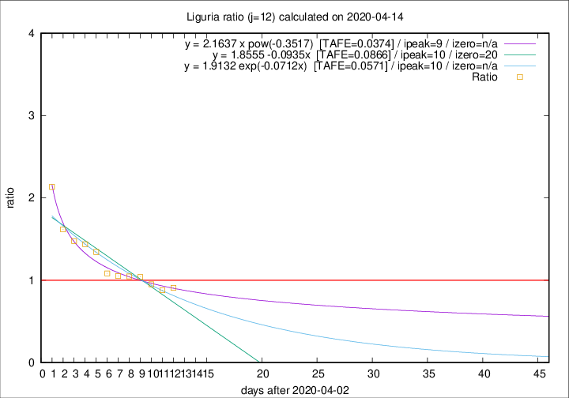

# Liguria

Data source: https://raw.githubusercontent.com/pcm-dpc/COVID-19/master/dati-json/dpc-covid19-ita-regioni.json

Delta days analysis (j): 12

Analyses for other values of j for 2020-04-14 are avalable [here](../2020-04-14/README.md)

Analyses for Liguria for previous dates are avalable [here](../README.md)

## Fitting 
|fit type|best fit equation|tafe|tfe|ipeak|izero|
|-------|-----|--------|------|---|---|
|linear|y = 1.8555 -0.0935x  [TAFE=0.0866]|0.0866|0.0057|10|20|
|exp|y = 1.9132 exp(-0.0712x)  [TAFE=0.0571]|0.0571|0.0032|10|n/a|
|pow|y = 2.1637 x pow(-0.3517)  [TAFE=0.0374]|0.0374|0.0011|9|n/a|

## Data
|Date|Daily deaths|Cumulated deaths|Deaths in the last 12 days|Deaths in the 12 days before|ratio|
|----|----------|-----------|-------|--------------------|-----|
|2020-04-14|33|793|305|336|0.9077|
|2020-04-13|11|760|300|341|0.8798|
|2020-04-12|15|749|321|337|0.9525|
|2020-04-11|25|734|337|324|1.0401|
|2020-04-10|27|709|332|317|1.0473|
|2020-04-09|28|682|324|308|1.0519|
|2020-04-08|34|654|323|298|1.0839|
|2020-04-07|25|620|340|253|1.3439|
|2020-04-06|39|595|341|237|1.4388|
|2020-04-05|14|556|325|220|1.4773|
|2020-04-04|23|542|330|204|1.6176|
|2020-04-03|31|519|348|163|2.1350|

[Download data as CSV](COVID-19_liguria_j12_2020-04-14.csv)

Generated April 14th, 2020 at 19:16:04 UTC+0200 with https://github.com/robianc/COVID-19
