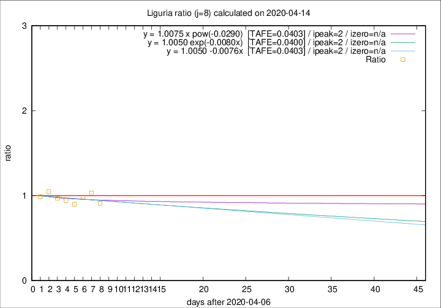

# Liguria

Data source: https://raw.githubusercontent.com/pcm-dpc/COVID-19/master/dati-json/dpc-covid19-ita-regioni.json

Delta days analysis (j): 8

Analyses for other values of j for 2020-04-14 are avalable [here](../2020-04-14/README.md)

Analyses for Liguria for previous dates are avalable [here](../README.md)

## Fitting 
|fit type|best fit equation|tafe|tfe|ipeak|izero|
|-------|-----|--------|------|---|---|
|linear|y = 1.0050 -0.0076x  [TAFE=0.0403]|0.0403|0.0023|2|n/a|
|exp|y = 1.0050 exp(-0.0080x)  [TAFE=0.0400]|0.0400|0.0011|2|n/a|
|pow|y = 1.0075 x pow(-0.0290)  [TAFE=0.0403]|0.0403|0.0011|2|n/a|

## Data
|Date|Daily deaths|Cumulated deaths|Deaths in the last 8 days|Deaths in the 8 days before|ratio|
|----|----------|-----------|-------|--------------------|-----|
|2020-04-14|33|793|198|218|0.9083|
|2020-04-13|11|760|204|198|1.0303|
|2020-04-12|15|749|207|211|0.9810|
|2020-04-11|25|734|215|239|0.8996|
|2020-04-10|27|709|221|234|0.9444|
|2020-04-09|28|682|222|229|0.9694|
|2020-04-08|34|654|226|216|1.0463|
|2020-04-07|25|620|223|226|0.9867|

[Download data as CSV](COVID-19_liguria_j8_2020-04-14.csv)

Generated April 16th, 2020 at 20:09:19 UTC+0200 with https://github.com/robianc/COVID-19
