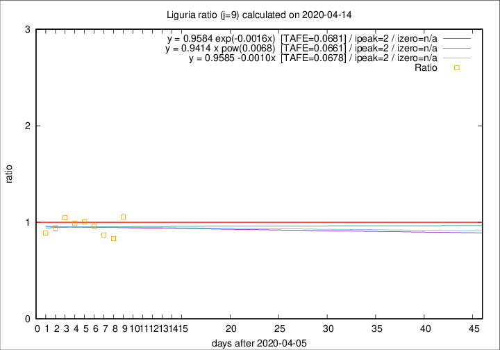

# Liguria

Data source: https://raw.githubusercontent.com/pcm-dpc/COVID-19/master/dati-json/dpc-covid19-ita-regioni.json

Delta days analysis (j): 9

Analyses for other values of j for 2020-04-14 are avalable [here](../2020-04-14/README.md)

Analyses for Liguria for previous dates are avalable [here](../README.md)

## Fitting 
|fit type|best fit equation|tafe|tfe|ipeak|izero|
|-------|-----|--------|------|---|---|
|linear|y = 0.9585 -0.0010x  [TAFE=0.0678]|0.0678|0.0062|2|n/a|
|exp|y = 0.9584 exp(-0.0016x)  [TAFE=0.0681]|0.0681|0.0033|2|n/a|
|pow|y = 0.9414 x pow(0.0068)  [TAFE=0.0661]|0.0661|0.0031|2|n/a|

## Data
|Date|Daily deaths|Cumulated deaths|Deaths in the last 9 days|Deaths in the 9 days before|ratio|
|----|----------|-----------|-------|--------------------|-----|
|2020-04-14|33|793|237|225|1.0533|
|2020-04-13|11|760|218|262|0.8321|
|2020-04-12|15|749|230|265|0.8679|
|2020-04-11|25|734|246|257|0.9572|
|2020-04-10|27|709|249|248|1.0040|
|2020-04-09|28|682|254|257|0.9883|
|2020-04-08|34|654|257|245|1.0490|
|2020-04-07|25|620|243|258|0.9419|
|2020-04-06|39|595|237|267|0.8876|

[Download data as CSV](COVID-19_liguria_j9_2020-04-14.csv)

Generated April 14th, 2020 at 19:16:04 UTC+0200 with https://github.com/robianc/COVID-19
