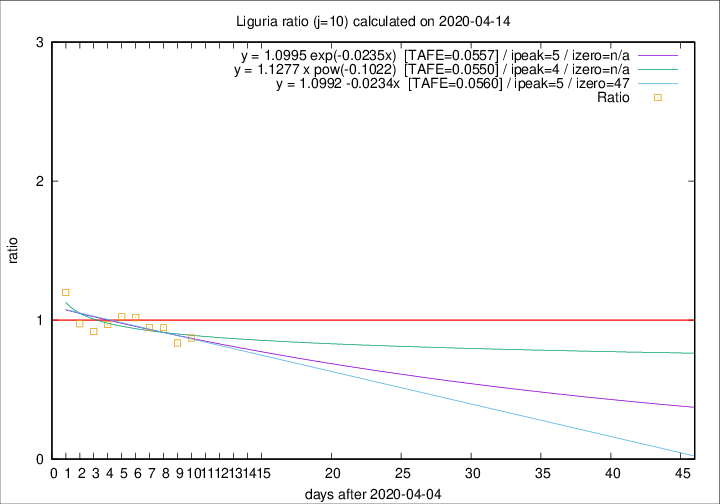

# Liguria

Data source: https://raw.githubusercontent.com/pcm-dpc/COVID-19/master/dati-json/dpc-covid19-ita-regioni.json

Estimates in this page were made on 16/4/2020 with data available until 14/04/2020.

## Summary 

### Peak estimate 
|j|linear [TAFE]|exponential [TAFE]|power law [TAFE]|details|
|---|----|-----------|---------|-------|
|7|10/4/2020 [TAFE=0.0724]|10/4/2020 [TAFE=0.0717]|10/4/2020 [TAFE=0.0736]|[analysis](COVID-19_liguria_j7_2020-04-14.md)|
|8|9/4/2020 [TAFE=0.0403]|9/4/2020 [TAFE=0.0400]|9/4/2020 [TAFE=0.0403]|[analysis](COVID-19_liguria_j8_2020-04-14.md)|
|9|8/4/2020 [TAFE=0.0678]|8/4/2020 [TAFE=0.0681]|8/4/2020 [TAFE=0.0661]|[analysis](COVID-19_liguria_j9_2020-04-14.md)|
|10|10/4/2020 [TAFE=0.0560]|10/4/2020 [TAFE=0.0557]|9/4/2020 [TAFE=0.0550]|[analysis](COVID-19_liguria_j10_2020-04-14.md)|
|11|12/4/2020 [TAFE=0.0588]|12/4/2020 [TAFE=0.0555]|11/4/2020 [TAFE=0.0399]|[analysis](COVID-19_liguria_j11_2020-04-14.md)|
|12|13/4/2020 [TAFE=0.0866]|13/4/2020 [TAFE=0.0571]|12/4/2020 [TAFE=0.0374]|[analysis](COVID-19_liguria_j12_2020-04-14.md)|
|13|13/4/2020 [TAFE=0.1510]|13/4/2020 [TAFE=0.0840]|14/4/2020 [TAFE=0.0533]|[analysis](COVID-19_liguria_j13_2020-04-14.md)|
|14|13/4/2020 [TAFE=0.2600]|14/4/2020 [TAFE=0.1126]|16/4/2020 [TAFE=0.0747]|[analysis](COVID-19_liguria_j14_2020-04-14.md)|

Best estimator is pow with j=12 (TAFE=0.0374)
Corresponding peak date estimate is 12/4/2020 (ipeak 9)

Peak date range estimate: 5/4/2020 - 18/4/2020

### End estimate 
|j|linear [TAFE/TFE]|exponential [TAFE/TFE]|power law [TAFE/TFE]|details|
|---|----|-----------|---------|-------|
|7|-|-|-|[analysis](COVID-19_liguria_j7_2020-04-14.md)|
|8|-|-|-|[analysis](COVID-19_liguria_j8_2020-04-14.md)|
|9|-|-|-|[analysis](COVID-19_liguria_j9_2020-04-14.md)|
|10|22/5/2020 [TAFE=0.0560]|-|-|[analysis](COVID-19_liguria_j10_2020-04-14.md)|
|11|-|-|-|[analysis](COVID-19_liguria_j11_2020-04-14.md)|
|12|-|-|-|[analysis](COVID-19_liguria_j12_2020-04-14.md)|
|13|-|-|-|[analysis](COVID-19_liguria_j13_2020-04-14.md)|
|14|-|-|-|[analysis](COVID-19_liguria_j14_2020-04-14.md)|

Best estimator is linear with j=10 (TAFE=0.0560)
Corresponding end date estimate is 22/5/2020 (izero 47)

End date range estimate: 5/4/2020 - 22/5/2020

Generated April 16th, 2020 at 20:09:19 UTC+0200 with https://github.com/robianc/COVID-19
