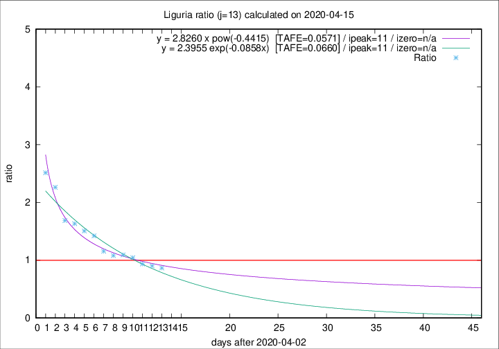

# Liguria

Data source: https://raw.githubusercontent.com/pcm-dpc/COVID-19/master/dati-json/dpc-covid19-ita-regioni.json

Delta days analysis (j): 13

Analyses for other values of j for 2020-04-15 are avalable [here](../2020-04-15/README.md)

Analyses for Liguria for previous dates are avalable [here](../README.md)

## Fitting 
|fit type|best fit equation|tafe|tfe|ipeak|izero|
|-------|-----|--------|------|---|---|
|exp|y = 2.3955 exp(-0.0858x)  [TAFE=0.0660]|0.0660|0.0032|11|n/a|
|pow|y = 2.8260 x pow(-0.4415)  [TAFE=0.0571]|0.0571|0.0020|11|n/a|

## Data
|Date|Daily deaths|Cumulated deaths|Deaths in the last 13 days|Deaths in the 13 days before|ratio|
|----|----------|-----------|-------|--------------------|-----|
|2020-04-15|14|807|319|369|0.8645|
|2020-04-14|33|793|333|369|0.9024|
|2020-04-13|11|760|332|355|0.9352|
|2020-04-12|15|749|352|337|1.0445|
|2020-04-11|25|734|357|327|1.0917|
|2020-04-10|27|709|351|325|1.0800|
|2020-04-09|28|682|351|304|1.1546|
|2020-04-08|34|654|374|263|1.4221|
|2020-04-07|25|620|366|243|1.5062|
|2020-04-06|39|595|364|223|1.6323|
|2020-04-05|14|556|344|204|1.6863|
|2020-04-04|23|542|371|164|2.2622|
|2020-04-03|31|519|367|146|2.5137|

[Download data as CSV](COVID-19_liguria_j13_2020-04-15.csv)

Generated April 19th, 2020 at 18:42:39 UTC+0200 with https://github.com/robianc/COVID-19
