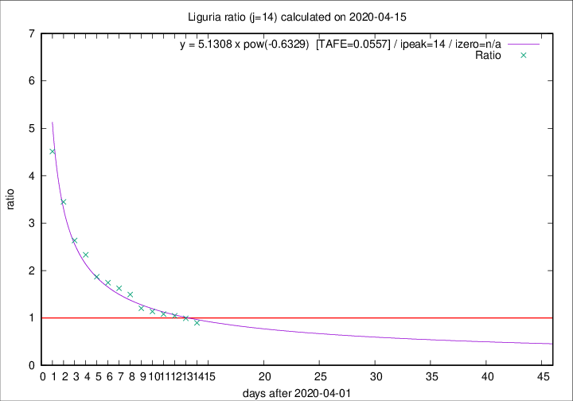

# Liguria

Data source: https://raw.githubusercontent.com/pcm-dpc/COVID-19/master/dati-json/dpc-covid19-ita-regioni.json

Delta days analysis (j): 14

Analyses for other values of j for 2020-04-15 are avalable [here](../2020-04-15/README.md)

Analyses for Liguria for previous dates are avalable [here](../README.md)

## Fitting 
|fit type|best fit equation|tafe|tfe|ipeak|izero|
|-------|-----|--------|------|---|---|
|pow|y = 5.1308 x pow(-0.6329)  [TAFE=0.0557]|0.0557|0.0021|14|n/a|

## Data
|Date|Daily deaths|Cumulated deaths|Deaths in the last 14 days|Deaths in the 14 days before|ratio|
|----|----------|-----------|-------|--------------------|-----|
|2020-04-15|14|807|347|387|0.8966|
|2020-04-14|33|793|365|368|0.9918|
|2020-04-13|11|760|363|347|1.0461|
|2020-04-12|15|749|372|344|1.0814|
|2020-04-11|25|734|376|331|1.1360|
|2020-04-10|27|709|378|314|1.2038|
|2020-04-09|28|682|402|269|1.4944|
|2020-04-08|34|654|400|246|1.6260|
|2020-04-07|25|620|389|223|1.7444|
|2020-04-06|39|595|383|205|1.8683|
|2020-04-05|14|556|385|165|2.3333|
|2020-04-04|23|542|390|148|2.6351|
|2020-04-03|31|519|400|116|3.4483|
|2020-04-02|28|488|397|88|4.5114|

[Download data as CSV](COVID-19_liguria_j14_2020-04-15.csv)

Generated April 16th, 2020 at 20:09:19 UTC+0200 with https://github.com/robianc/COVID-19
