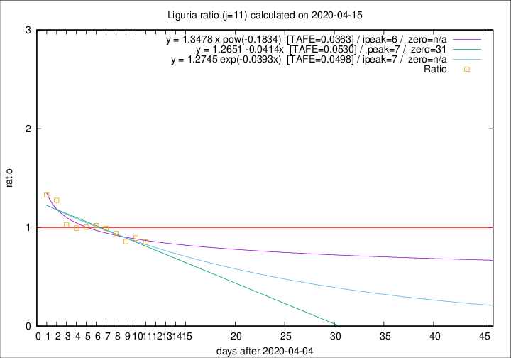
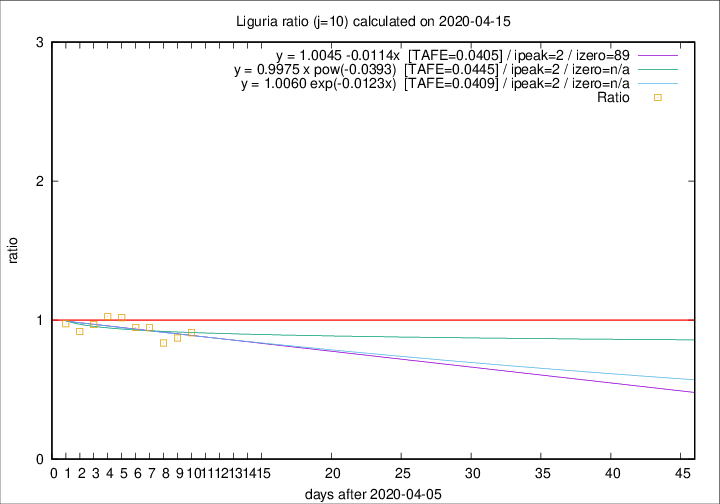

# Liguria

Data source: https://raw.githubusercontent.com/pcm-dpc/COVID-19/master/dati-json/dpc-covid19-ita-regioni.json

Estimates in this page were made on 19/4/2020 with data available until 15/04/2020.

## Summary 

### Peak estimate 
|j|linear [TAFE]|exponential [TAFE]|power law [TAFE]|details|
|---|----|-----------|---------|-------|
|7|12/4/2020 [TAFE=0.0720]|12/4/2020 [TAFE=0.0729]|11/4/2020 [TAFE=0.0848]|[analysis](COVID-19_liguria_j7_2020-04-15.md)|
|8|10/4/2020 [TAFE=0.0460]|10/4/2020 [TAFE=0.0455]|10/4/2020 [TAFE=0.0431]|[analysis](COVID-19_liguria_j8_2020-04-15.md)|
|9|9/4/2020 [TAFE=0.0585]|9/4/2020 [TAFE=0.0585]|9/4/2020 [TAFE=0.0641]|[analysis](COVID-19_liguria_j9_2020-04-15.md)|
|10|8/4/2020 [TAFE=0.0405]|8/4/2020 [TAFE=0.0409]|8/4/2020 [TAFE=0.0445]|[analysis](COVID-19_liguria_j10_2020-04-15.md)|
|11|12/4/2020 [TAFE=0.0530]|12/4/2020 [TAFE=0.0498]|11/4/2020 [TAFE=0.0363]|[analysis](COVID-19_liguria_j11_2020-04-15.md)|
|12|13/4/2020 [TAFE=0.0558]|13/4/2020 [TAFE=0.0449]|12/4/2020 [TAFE=0.0474]|[analysis](COVID-19_liguria_j12_2020-04-15.md)|
|13|14/4/2020 [TAFE=0.1163]|14/4/2020 [TAFE=0.0660]|14/4/2020 [TAFE=0.0571]|[analysis](COVID-19_liguria_j13_2020-04-15.md)|
|14|14/4/2020 [TAFE=0.2191]|14/4/2020 [TAFE=0.0995]|16/4/2020 [TAFE=0.0557]|[analysis](COVID-19_liguria_j14_2020-04-15.md)|

Best estimator is pow with j=11 (TAFE=0.0363)
Corresponding peak date estimate is 11/4/2020 (ipeak 6)

Peak date range estimate: 7/4/2020 - 19/4/2020

### End estimate 
|j|linear [TAFE/TFE]|exponential [TAFE/TFE]|power law [TAFE/TFE]|details|
|---|----|-----------|---------|-------|
|7|14/5/2020 [TAFE=0.0720]|-|-|[analysis](COVID-19_liguria_j7_2020-04-15.md)|
|8|8/6/2020 [TAFE=0.0460]|-|-|[analysis](COVID-19_liguria_j8_2020-04-15.md)|
|9|-|-|-|[analysis](COVID-19_liguria_j9_2020-04-15.md)|
|10|4/7/2020 [TAFE=0.0405]|-|-|[analysis](COVID-19_liguria_j10_2020-04-15.md)|
|11|-|-|-|[analysis](COVID-19_liguria_j11_2020-04-15.md)|
|12|-|-|-|[analysis](COVID-19_liguria_j12_2020-04-15.md)|
|13|-|-|-|[analysis](COVID-19_liguria_j13_2020-04-15.md)|
|14|-|-|-|[analysis](COVID-19_liguria_j14_2020-04-15.md)|

Best estimator is linear with j=10 (TAFE=0.0405)
Corresponding end date estimate is 4/7/2020 (izero 89)

End date range estimate: 6/4/2020 - 12/7/2020

Generated April 19th, 2020 at 18:42:39 UTC+0200 with https://github.com/robianc/COVID-19
