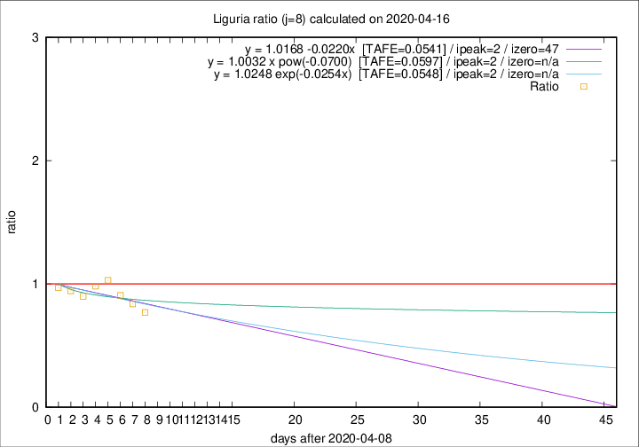

# Liguria

Data source: https://raw.githubusercontent.com/pcm-dpc/COVID-19/master/dati-json/dpc-covid19-ita-regioni.json

Delta days analysis (j): 8

Analyses for other values of j for 2020-04-16 are avalable [here](../2020-04-16/README.md)

Analyses for Liguria for previous dates are avalable [here](../README.md)

## Fitting 
|fit type|best fit equation|tafe|tfe|ipeak|izero|
|-------|-----|--------|------|---|---|
|linear|y = 1.0168 -0.0220x  [TAFE=0.0541]|0.0541|0.0044|2|47|
|exp|y = 1.0248 exp(-0.0254x)  [TAFE=0.0548]|0.0548|0.0019|2|n/a|
|pow|y = 1.0032 x pow(-0.0700)  [TAFE=0.0597]|0.0597|0.0028|2|n/a|

## Data
|Date|Daily deaths|Cumulated deaths|Deaths in the last 8 days|Deaths in the 8 days before|ratio|
|----|----------|-----------|-------|--------------------|-----|
|2020-04-16|21|828|174|226|0.7699|
|2020-04-15|14|807|187|223|0.8386|
|2020-04-14|33|793|198|218|0.9083|
|2020-04-13|11|760|204|198|1.0303|
|2020-04-12|15|749|207|211|0.9810|
|2020-04-11|25|734|215|239|0.8996|
|2020-04-10|27|709|221|234|0.9444|
|2020-04-09|28|682|222|229|0.9694|

[Download data as CSV](COVID-19_liguria_j8_2020-04-16.csv)

Generated April 19th, 2020 at 18:42:39 UTC+0200 with https://github.com/robianc/COVID-19
