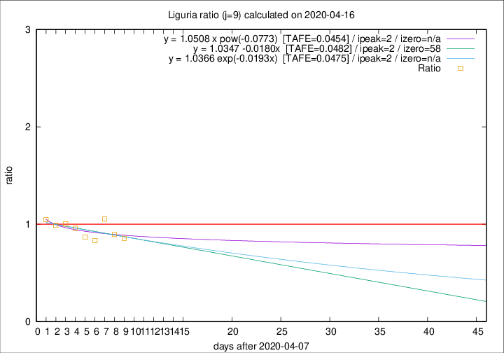

# Liguria

Data source: https://raw.githubusercontent.com/pcm-dpc/COVID-19/master/dati-json/dpc-covid19-ita-regioni.json

Delta days analysis (j): 9

Analyses for other values of j for 2020-04-16 are avalable [here](../2020-04-16/README.md)

Analyses for Liguria for previous dates are avalable [here](../README.md)

## Fitting 
|fit type|best fit equation|tafe|tfe|ipeak|izero|
|-------|-----|--------|------|---|---|
|linear|y = 1.0347 -0.0180x  [TAFE=0.0482]|0.0482|0.0047|2|58|
|exp|y = 1.0366 exp(-0.0193x)  [TAFE=0.0475]|0.0475|0.0022|2|n/a|
|pow|y = 1.0508 x pow(-0.0773)  [TAFE=0.0454]|0.0454|0.0022|2|n/a|

## Data
|Date|Daily deaths|Cumulated deaths|Deaths in the last 9 days|Deaths in the 9 days before|ratio|
|----|----------|-----------|-------|--------------------|-----|
|2020-04-16|21|828|208|243|0.8560|
|2020-04-15|14|807|212|237|0.8945|
|2020-04-14|33|793|237|225|1.0533|
|2020-04-13|11|760|218|262|0.8321|
|2020-04-12|15|749|230|265|0.8679|
|2020-04-11|25|734|246|257|0.9572|
|2020-04-10|27|709|249|248|1.0040|
|2020-04-09|28|682|254|257|0.9883|
|2020-04-08|34|654|257|245|1.0490|

[Download data as CSV](COVID-19_liguria_j9_2020-04-16.csv)

Generated April 16th, 2020 at 20:09:19 UTC+0200 with https://github.com/robianc/COVID-19
