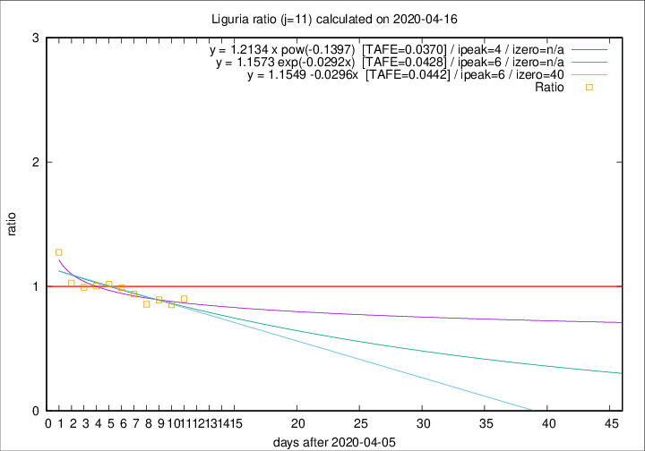

# Liguria

Data source: https://raw.githubusercontent.com/pcm-dpc/COVID-19/master/dati-json/dpc-covid19-ita-regioni.json

Estimates in this page were made on 19/4/2020 with data available until 16/04/2020.

## Summary 

### Peak estimate 
|j|linear [TAFE]|exponential [TAFE]|power law [TAFE]|details|
|---|----|-----------|---------|-------|
|7|13/4/2020 [TAFE=0.0518]|13/4/2020 [TAFE=0.0538]|12/4/2020 [TAFE=0.0747]|[analysis](COVID-19_liguria_j7_2020-04-16.md)|
|8|11/4/2020 [TAFE=0.0541]|11/4/2020 [TAFE=0.0548]|11/4/2020 [TAFE=0.0597]|[analysis](COVID-19_liguria_j8_2020-04-16.md)|
|9|10/4/2020 [TAFE=0.0482]|10/4/2020 [TAFE=0.0475]|10/4/2020 [TAFE=0.0454]|[analysis](COVID-19_liguria_j9_2020-04-16.md)|
|10|9/4/2020 [TAFE=0.0396]|9/4/2020 [TAFE=0.0399]|9/4/2020 [TAFE=0.0452]|[analysis](COVID-19_liguria_j10_2020-04-16.md)|
|11|12/4/2020 [TAFE=0.0442]|12/4/2020 [TAFE=0.0428]|10/4/2020 [TAFE=0.0370]|[analysis](COVID-19_liguria_j11_2020-04-16.md)|
|12|13/4/2020 [TAFE=0.0621]|13/4/2020 [TAFE=0.0518]|12/4/2020 [TAFE=0.0428]|[analysis](COVID-19_liguria_j12_2020-04-16.md)|
|13|14/4/2020 [TAFE=0.0872]|14/4/2020 [TAFE=0.0517]|14/4/2020 [TAFE=0.0489]|[analysis](COVID-19_liguria_j13_2020-04-16.md)|
|14|15/4/2020 [TAFE=0.1575]|15/4/2020 [TAFE=0.0756]|16/4/2020 [TAFE=0.0559]|[analysis](COVID-19_liguria_j14_2020-04-16.md)|

Best estimator is pow with j=11 (TAFE=0.0370)
Corresponding peak date estimate is 10/4/2020 (ipeak 4)

Peak date range estimate: 8/4/2020 - 19/4/2020

### End estimate 
|j|linear [TAFE/TFE]|exponential [TAFE/TFE]|power law [TAFE/TFE]|details|
|---|----|-----------|---------|-------|
|7|2/5/2020 [TAFE=0.0518]|-|-|[analysis](COVID-19_liguria_j7_2020-04-16.md)|
|8|-|-|-|[analysis](COVID-19_liguria_j8_2020-04-16.md)|
|9|5/6/2020 [TAFE=0.0482]|-|-|[analysis](COVID-19_liguria_j9_2020-04-16.md)|
|10|27/6/2020 [TAFE=0.0396]|-|-|[analysis](COVID-19_liguria_j10_2020-04-16.md)|
|11|-|-|-|[analysis](COVID-19_liguria_j11_2020-04-16.md)|
|12|-|-|-|[analysis](COVID-19_liguria_j12_2020-04-16.md)|
|13|-|-|-|[analysis](COVID-19_liguria_j13_2020-04-16.md)|
|14|-|-|-|[analysis](COVID-19_liguria_j14_2020-04-16.md)|

Best estimator is linear with j=10 (TAFE=0.0396)
Corresponding end date estimate is 27/6/2020 (izero 81)

End date range estimate: 7/4/2020 - 27/6/2020

Generated April 19th, 2020 at 18:42:39 UTC+0200 with https://github.com/robianc/COVID-19
