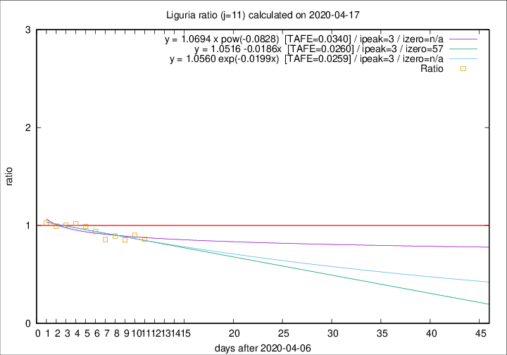

# Liguria

Data source: https://raw.githubusercontent.com/pcm-dpc/COVID-19/master/dati-json/dpc-covid19-ita-regioni.json

Estimates in this page were made on 19/4/2020 with data available until 17/04/2020.

## Summary 

### Peak estimate 
|j|linear [TAFE]|exponential [TAFE]|power law [TAFE]|details|
|---|----|-----------|---------|-------|
|7|13/4/2020 [TAFE=0.0646]|13/4/2020 [TAFE=0.0632]|13/4/2020 [TAFE=0.0630]|[analysis](COVID-19_liguria_j7_2020-04-17.md)|
|8|12/4/2020 [TAFE=0.0536]|12/4/2020 [TAFE=0.0543]|12/4/2020 [TAFE=0.0623]|[analysis](COVID-19_liguria_j8_2020-04-17.md)|
|9|11/4/2020 [TAFE=0.0466]|11/4/2020 [TAFE=0.0464]|11/4/2020 [TAFE=0.0522]|[analysis](COVID-19_liguria_j9_2020-04-17.md)|
|10|10/4/2020 [TAFE=0.0372]|10/4/2020 [TAFE=0.0371]|10/4/2020 [TAFE=0.0402]|[analysis](COVID-19_liguria_j10_2020-04-17.md)|
|11|10/4/2020 [TAFE=0.0260]|10/4/2020 [TAFE=0.0259]|10/4/2020 [TAFE=0.0340]|[analysis](COVID-19_liguria_j11_2020-04-17.md)|
|12|14/4/2020 [TAFE=0.0743]|13/4/2020 [TAFE=0.0651]|12/4/2020 [TAFE=0.0401]|[analysis](COVID-19_liguria_j12_2020-04-17.md)|
|13|15/4/2020 [TAFE=0.0704]|14/4/2020 [TAFE=0.0520]|14/4/2020 [TAFE=0.0542]|[analysis](COVID-19_liguria_j13_2020-04-17.md)|
|14|15/4/2020 [TAFE=0.1186]|15/4/2020 [TAFE=0.0595]|15/4/2020 [TAFE=0.0559]|[analysis](COVID-19_liguria_j14_2020-04-17.md)|

Best estimator is exp with j=11 (TAFE=0.0259)
Corresponding peak date estimate is 10/4/2020 (ipeak 3)

Peak date range estimate: 9/4/2020 - 18/4/2020

### End estimate 
|j|linear [TAFE/TFE]|exponential [TAFE/TFE]|power law [TAFE/TFE]|details|
|---|----|-----------|---------|-------|
|7|4/5/2020 [TAFE=0.0646]|-|-|[analysis](COVID-19_liguria_j7_2020-04-17.md)|
|8|23/5/2020 [TAFE=0.0536]|-|-|[analysis](COVID-19_liguria_j8_2020-04-17.md)|
|9|7/6/2020 [TAFE=0.0466]|-|-|[analysis](COVID-19_liguria_j9_2020-04-17.md)|
|10|25/6/2020 [TAFE=0.0372]|-|-|[analysis](COVID-19_liguria_j10_2020-04-17.md)|
|11|3/6/2020 [TAFE=0.0260]|-|-|[analysis](COVID-19_liguria_j11_2020-04-17.md)|
|12|-|-|-|[analysis](COVID-19_liguria_j12_2020-04-17.md)|
|13|-|-|-|[analysis](COVID-19_liguria_j13_2020-04-17.md)|
|14|-|-|-|[analysis](COVID-19_liguria_j14_2020-04-17.md)|

Best estimator is linear with j=11 (TAFE=0.0260)
Corresponding end date estimate is 3/6/2020 (izero 57)

End date range estimate: 7/4/2020 - 24/6/2020

Generated April 19th, 2020 at 18:42:39 UTC+0200 with https://github.com/robianc/COVID-19
