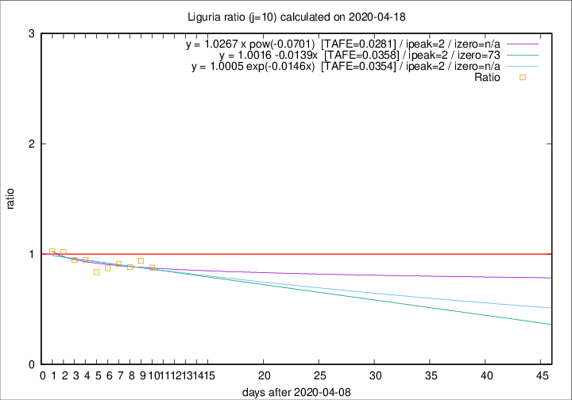

# Liguria

Data source: https://raw.githubusercontent.com/pcm-dpc/COVID-19/master/dati-json/dpc-covid19-ita-regioni.json

Delta days analysis (j): 10

Analyses for other values of j for 2020-04-18 are avalable [here](../2020-04-18/README.md)

Analyses for Liguria for previous dates are avalable [here](../README.md)

## Fitting 
|fit type|best fit equation|tafe|tfe|ipeak|izero|
|-------|-----|--------|------|---|---|
|linear|y = 1.0016 -0.0139x  [TAFE=0.0358]|0.0358|0.0020|2|73|
|exp|y = 1.0005 exp(-0.0146x)  [TAFE=0.0354]|0.0354|0.0009|2|n/a|
|pow|y = 1.0267 x pow(-0.0701)  [TAFE=0.0281]|0.0281|0.0009|2|n/a|

## Data
|Date|Daily deaths|Cumulated deaths|Deaths in the last 10 days|Deaths in the 10 days before|ratio|
|----|----------|-----------|-------|--------------------|-----|
|2020-04-18|31|897|243|277|0.8773|
|2020-04-17|38|866|246|262|0.9389|
|2020-04-16|21|828|233|264|0.8826|
|2020-04-15|14|807|251|276|0.9094|
|2020-04-14|33|793|251|288|0.8715|
|2020-04-13|11|760|241|288|0.8368|
|2020-04-12|15|749|261|276|0.9457|
|2020-04-11|25|734|274|289|0.9481|
|2020-04-10|27|709|281|276|1.0181|
|2020-04-09|28|682|285|278|1.0252|

[Download data as CSV](COVID-19_liguria_j10_2020-04-18.csv)

Generated April 19th, 2020 at 18:42:39 UTC+0200 with https://github.com/robianc/COVID-19
