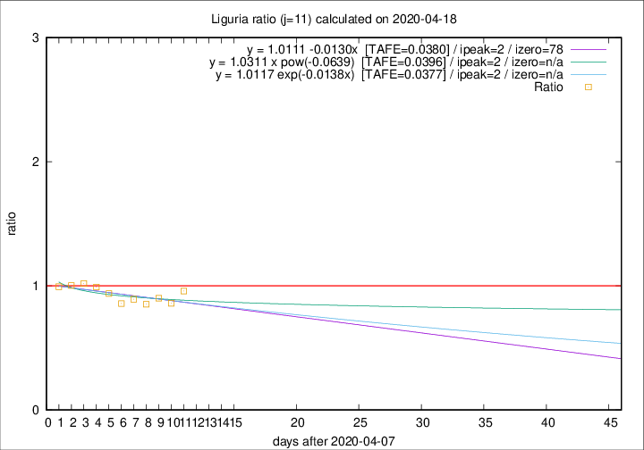

# Liguria

Data source: https://raw.githubusercontent.com/pcm-dpc/COVID-19/master/dati-json/dpc-covid19-ita-regioni.json

Delta days analysis (j): 11

Analyses for other values of j for 2020-04-18 are avalable [here](../2020-04-18/README.md)

Analyses for Liguria for previous dates are avalable [here](../README.md)

## Fitting 
|fit type|best fit equation|tafe|tfe|ipeak|izero|
|-------|-----|--------|------|---|---|
|linear|y = 1.0111 -0.0130x  [TAFE=0.0380]|0.0380|0.0020|2|78|
|exp|y = 1.0117 exp(-0.0138x)  [TAFE=0.0377]|0.0377|0.0011|2|n/a|
|pow|y = 1.0311 x pow(-0.0639)  [TAFE=0.0396]|0.0396|0.0011|2|n/a|

## Data
|Date|Daily deaths|Cumulated deaths|Deaths in the last 11 days|Deaths in the 11 days before|ratio|
|----|----------|-----------|-------|--------------------|-----|
|2020-04-18|31|897|277|289|0.9585|
|2020-04-17|38|866|271|315|0.8603|
|2020-04-16|21|828|272|302|0.9007|
|2020-04-15|14|807|265|311|0.8521|
|2020-04-14|33|793|274|307|0.8925|
|2020-04-13|11|760|272|317|0.8580|
|2020-04-12|15|749|289|308|0.9383|
|2020-04-11|25|734|306|309|0.9903|
|2020-04-10|27|709|312|306|1.0196|
|2020-04-09|28|682|305|304|1.0033|
|2020-04-08|34|654|296|298|0.9933|

[Download data as CSV](COVID-19_liguria_j11_2020-04-18.csv)

Generated April 19th, 2020 at 18:42:39 UTC+0200 with https://github.com/robianc/COVID-19
