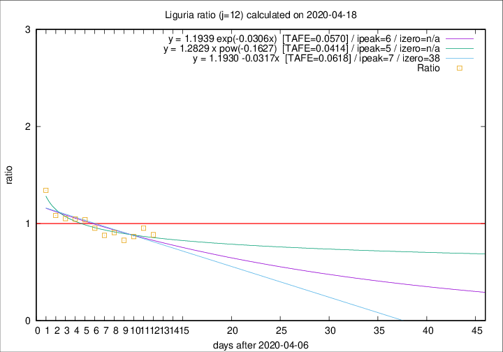

# Liguria

Data source: https://raw.githubusercontent.com/pcm-dpc/COVID-19/master/dati-json/dpc-covid19-ita-regioni.json

Delta days analysis (j): 12

Analyses for other values of j for 2020-04-18 are avalable [here](../2020-04-18/README.md)

Analyses for Liguria for previous dates are avalable [here](../README.md)

## Fitting 
|fit type|best fit equation|tafe|tfe|ipeak|izero|
|-------|-----|--------|------|---|---|
|linear|y = 1.1930 -0.0317x  [TAFE=0.0618]|0.0618|0.0054|7|38|
|exp|y = 1.1939 exp(-0.0306x)  [TAFE=0.0570]|0.0570|0.0027|6|n/a|
|pow|y = 1.2829 x pow(-0.1627)  [TAFE=0.0414]|0.0414|0.0012|5|n/a|

## Data
|Date|Daily deaths|Cumulated deaths|Deaths in the last 12 days|Deaths in the 12 days before|ratio|
|----|----------|-----------|-------|--------------------|-----|
|2020-04-18|31|897|302|341|0.8856|
|2020-04-17|38|866|310|325|0.9538|
|2020-04-16|21|828|286|330|0.8667|
|2020-04-15|14|807|288|348|0.8276|
|2020-04-14|33|793|305|336|0.9077|
|2020-04-13|11|760|300|341|0.8798|
|2020-04-12|15|749|321|337|0.9525|
|2020-04-11|25|734|337|324|1.0401|
|2020-04-10|27|709|332|317|1.0473|
|2020-04-09|28|682|324|308|1.0519|
|2020-04-08|34|654|323|298|1.0839|
|2020-04-07|25|620|340|253|1.3439|

[Download data as CSV](COVID-19_liguria_j12_2020-04-18.csv)

Generated April 19th, 2020 at 18:42:39 UTC+0200 with https://github.com/robianc/COVID-19
