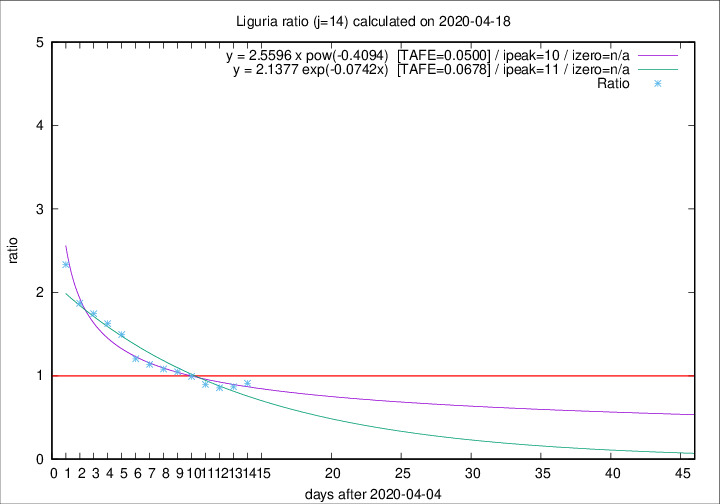

# Liguria

Data source: https://raw.githubusercontent.com/pcm-dpc/COVID-19/master/dati-json/dpc-covid19-ita-regioni.json

Delta days analysis (j): 14

Analyses for other values of j for 2020-04-18 are avalable [here](../2020-04-18/README.md)

Analyses for Liguria for previous dates are avalable [here](../README.md)

## Fitting 
|fit type|best fit equation|tafe|tfe|ipeak|izero|
|-------|-----|--------|------|---|---|
|exp|y = 2.1377 exp(-0.0742x)  [TAFE=0.0678]|0.0678|0.0039|11|n/a|
|pow|y = 2.5596 x pow(-0.4094)  [TAFE=0.0500]|0.0500|0.0020|10|n/a|

## Data
|Date|Daily deaths|Cumulated deaths|Deaths in the last 14 days|Deaths in the 14 days before|ratio|
|----|----------|-----------|-------|--------------------|-----|
|2020-04-18|31|897|355|390|0.9103|
|2020-04-17|38|866|347|400|0.8675|
|2020-04-16|21|828|340|397|0.8564|
|2020-04-15|14|807|347|387|0.8966|
|2020-04-14|33|793|365|368|0.9918|
|2020-04-13|11|760|363|347|1.0461|
|2020-04-12|15|749|372|344|1.0814|
|2020-04-11|25|734|376|331|1.1360|
|2020-04-10|27|709|378|314|1.2038|
|2020-04-09|28|682|402|269|1.4944|
|2020-04-08|34|654|400|246|1.6260|
|2020-04-07|25|620|389|223|1.7444|
|2020-04-06|39|595|383|205|1.8683|
|2020-04-05|14|556|385|165|2.3333|

[Download data as CSV](COVID-19_liguria_j14_2020-04-18.csv)

Generated April 19th, 2020 at 18:42:39 UTC+0200 with https://github.com/robianc/COVID-19
