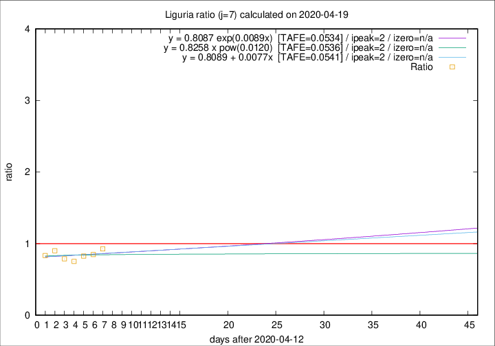

# Liguria

Data source: https://raw.githubusercontent.com/pcm-dpc/COVID-19/master/dati-json/dpc-covid19-ita-regioni.json

Delta days analysis (j): 7

Analyses for other values of j for 2020-04-19 are avalable [here](../2020-04-19/README.md)

Analyses for Liguria for previous dates are avalable [here](../README.md)

## Fitting 
|fit type|best fit equation|tafe|tfe|ipeak|izero|
|-------|-----|--------|------|---|---|
|linear|y = 0.8089 + 0.0077x  [TAFE=0.0541]|0.0541|0.0041|2|n/a|
|exp|y = 0.8087 exp(0.0089x)  [TAFE=0.0534]|0.0534|0.0022|2|n/a|
|pow|y = 0.8258 x pow(0.0120)  [TAFE=0.0536]|0.0536|0.0023|2|n/a|

## Data
|Date|Daily deaths|Cumulated deaths|Deaths in the last 7 days|Deaths in the 7 days before|ratio|
|----|----------|-----------|-------|--------------------|-----|
|2020-04-19|31|928|179|193|0.9275|
|2020-04-18|31|897|163|192|0.8490|
|2020-04-17|38|866|157|190|0.8263|
|2020-04-16|21|828|146|194|0.7526|
|2020-04-15|14|807|153|194|0.7887|
|2020-04-14|33|793|173|192|0.9010|
|2020-04-13|11|760|165|198|0.8333|

[Download data as CSV](COVID-19_liguria_j7_2020-04-19.csv)

Generated April 19th, 2020 at 18:42:39 UTC+0200 with https://github.com/robianc/COVID-19
