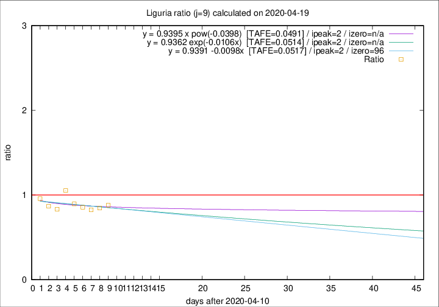

# Liguria

Data source: https://raw.githubusercontent.com/pcm-dpc/COVID-19/master/dati-json/dpc-covid19-ita-regioni.json

Delta days analysis (j): 9

Analyses for other values of j for 2020-04-19 are avalable [here](../2020-04-19/README.md)

Analyses for Liguria for previous dates are avalable [here](../README.md)

## Fitting 
|fit type|best fit equation|tafe|tfe|ipeak|izero|
|-------|-----|--------|------|---|---|
|linear|y = 0.9391 -0.0098x  [TAFE=0.0517]|0.0517|0.0046|2|96|
|exp|y = 0.9362 exp(-0.0106x)  [TAFE=0.0514]|0.0514|0.0024|2|n/a|
|pow|y = 0.9395 x pow(-0.0398)  [TAFE=0.0491]|0.0491|0.0023|2|n/a|

## Data
|Date|Daily deaths|Cumulated deaths|Deaths in the last 9 days|Deaths in the 9 days before|ratio|
|----|----------|-----------|-------|--------------------|-----|
|2020-04-19|31|928|219|249|0.8795|
|2020-04-18|31|897|215|254|0.8465|
|2020-04-17|38|866|212|257|0.8249|
|2020-04-16|21|828|208|243|0.8560|
|2020-04-15|14|807|212|237|0.8945|
|2020-04-14|33|793|237|225|1.0533|
|2020-04-13|11|760|218|262|0.8321|
|2020-04-12|15|749|230|265|0.8679|
|2020-04-11|25|734|246|257|0.9572|

[Download data as CSV](COVID-19_liguria_j9_2020-04-19.csv)

Generated April 19th, 2020 at 18:42:39 UTC+0200 with https://github.com/robianc/COVID-19
