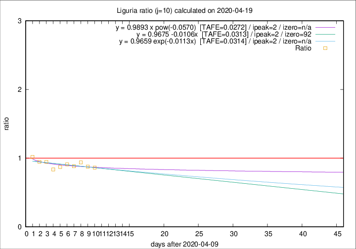

# Liguria

Data source: https://raw.githubusercontent.com/pcm-dpc/COVID-19/master/dati-json/dpc-covid19-ita-regioni.json

Estimates in this page were made on 19/4/2020 with data available until 19/04/2020.

## Summary 

### Peak estimate 
|j|linear [TAFE]|exponential [TAFE]|power law [TAFE]|details|
|---|----|-----------|---------|-------|
|7|15/4/2020 [TAFE=0.0541]|15/4/2020 [TAFE=0.0534]|15/4/2020 [TAFE=0.0536]|[analysis](COVID-19_liguria_j7_2020-04-19.md)|
|8|14/4/2020 [TAFE=0.0599]|14/4/2020 [TAFE=0.0587]|14/4/2020 [TAFE=0.0512]|[analysis](COVID-19_liguria_j8_2020-04-19.md)|
|9|13/4/2020 [TAFE=0.0517]|13/4/2020 [TAFE=0.0514]|13/4/2020 [TAFE=0.0491]|[analysis](COVID-19_liguria_j9_2020-04-19.md)|
|10|12/4/2020 [TAFE=0.0313]|12/4/2020 [TAFE=0.0314]|12/4/2020 [TAFE=0.0272]|[analysis](COVID-19_liguria_j10_2020-04-19.md)|
|11|11/4/2020 [TAFE=0.0459]|11/4/2020 [TAFE=0.0453]|11/4/2020 [TAFE=0.0383]|[analysis](COVID-19_liguria_j11_2020-04-19.md)|
|12|12/4/2020 [TAFE=0.0489]|12/4/2020 [TAFE=0.0477]|12/4/2020 [TAFE=0.0391]|[analysis](COVID-19_liguria_j12_2020-04-19.md)|
|13|16/4/2020 [TAFE=0.0942]|15/4/2020 [TAFE=0.0823]|14/4/2020 [TAFE=0.0520]|[analysis](COVID-19_liguria_j13_2020-04-19.md)|
|14|17/4/2020 [TAFE=0.1090]|16/4/2020 [TAFE=0.0880]|16/4/2020 [TAFE=0.0582]|[analysis](COVID-19_liguria_j14_2020-04-19.md)|

Best estimator is pow with j=10 (TAFE=0.0272)
Corresponding peak date estimate is 12/4/2020 (ipeak 2)

Peak date range estimate: 12/4/2020 - 21/4/2020

### End estimate 
|j|linear [TAFE/TFE]|exponential [TAFE/TFE]|power law [TAFE/TFE]|details|
|---|----|-----------|---------|-------|
|7|-|-|-|[analysis](COVID-19_liguria_j7_2020-04-19.md)|
|8|30/5/2020 [TAFE=0.0599]|-|-|[analysis](COVID-19_liguria_j8_2020-04-19.md)|
|9|16/7/2020 [TAFE=0.0517]|-|-|[analysis](COVID-19_liguria_j9_2020-04-19.md)|
|10|11/7/2020 [TAFE=0.0313]|-|-|[analysis](COVID-19_liguria_j10_2020-04-19.md)|
|11|-|-|-|[analysis](COVID-19_liguria_j11_2020-04-19.md)|
|12|-|-|-|[analysis](COVID-19_liguria_j12_2020-04-19.md)|
|13|-|-|-|[analysis](COVID-19_liguria_j13_2020-04-19.md)|
|14|-|-|-|[analysis](COVID-19_liguria_j14_2020-04-19.md)|

Best estimator is linear with j=10 (TAFE=0.0313)
Corresponding end date estimate is 11/7/2020 (izero 92)

End date range estimate: 10/4/2020 - 18/7/2020

Generated April 19th, 2020 at 18:42:39 UTC+0200 with https://github.com/robianc/COVID-19
