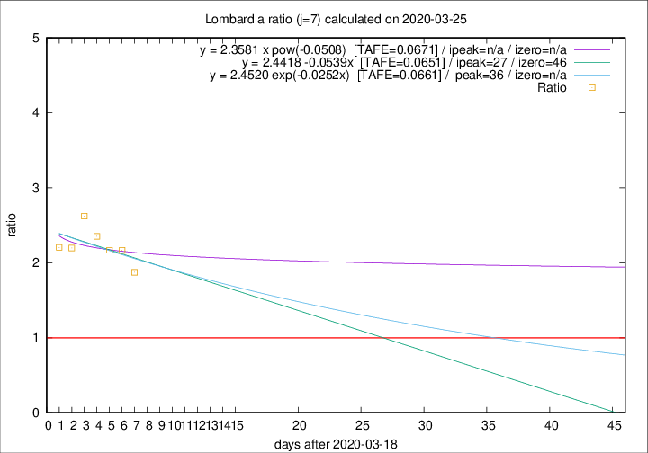

# Lombardia

Data source: https://raw.githubusercontent.com/pcm-dpc/COVID-19/master/dati-json/dpc-covid19-ita-regioni.json

Delta days analysis (j): 7

Analyses for other values of j for 2020-03-25 are avalable [here](../2020-03-25/README.md)

Analyses for Lombardia for previous dates are avalable [here](../README.md)

## Fitting 
|fit type|best fit equation|tafe|tfe|ipeak|izero|
|-------|-----|--------|------|---|---|
|linear|y = 2.4418 -0.0539x  [TAFE=0.0651]|0.0651|0.0062|27|46|
|exp|y = 2.4520 exp(-0.0252x)  [TAFE=0.0661]|0.0661|0.0032|36|n/a|
|pow|y = 2.3581 x pow(-0.0508)  [TAFE=0.0671]|0.0671|0.0038|n/a|n/a|

## Data
|Date|Daily deaths|Cumulated deaths|Deaths in the last 7 days|Deaths in the 7 days before|ratio|
|----|----------|-----------|-------|--------------------|-----|
|2020-03-25|296|4474|2515|1342|1.8741|
|2020-03-24|402|4178|2538|1172|2.1655|
|2020-03-23|320|3776|2356|1087|2.1674|
|2020-03-22|361|3456|2238|951|2.3533|
|2020-03-21|546|3095|2129|812|2.6219|
|2020-03-20|381|2549|1659|755|2.1974|
|2020-03-19|209|2168|1424|646|2.2043|

[Download data as CSV](COVID-19_lombardia_j7_2020-03-25.csv)

Generated April 16th, 2020 at 20:09:19 UTC+0200 with https://github.com/robianc/COVID-19
