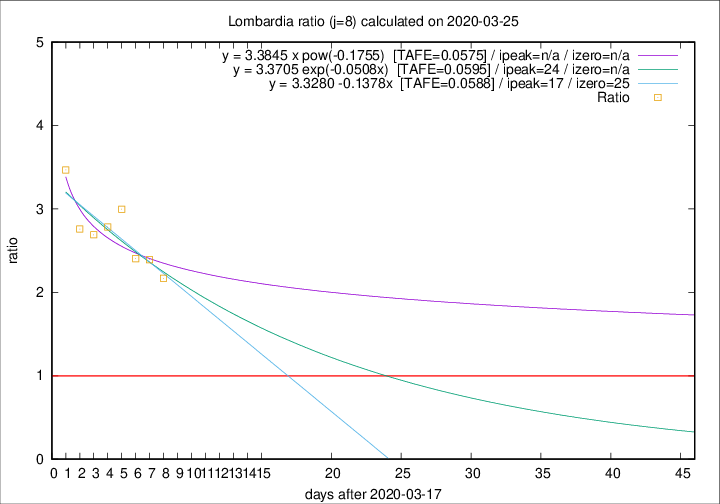

# Lombardia

Data source: https://raw.githubusercontent.com/pcm-dpc/COVID-19/master/dati-json/dpc-covid19-ita-regioni.json

Estimates in this page were made on 19/4/2020 with data available until 25/03/2020.

## Summary 

### Peak estimate 
|j|linear [TAFE]|exponential [TAFE]|power law [TAFE]|details|
|---|----|-----------|---------|-------|
|7|15/4/2020 [TAFE=0.0651]|24/4/2020 [TAFE=0.0661]|-|[analysis](COVID-19_lombardia_j7_2020-03-25.md)|
|8|4/4/2020 [TAFE=0.0588]|11/4/2020 [TAFE=0.0595]|-|[analysis](COVID-19_lombardia_j8_2020-03-25.md)|
|9|30/3/2020 [TAFE=0.0950]|5/4/2020 [TAFE=0.0699]|-|[analysis](COVID-19_lombardia_j9_2020-03-25.md)|
|10|28/3/2020 [TAFE=0.1834]|2/4/2020 [TAFE=0.1011]|27/5/2020 [TAFE=0.0775]|[analysis](COVID-19_lombardia_j10_2020-03-25.md)|
|11|-|-|-||
|12|-|-|-||
|13|-|-|-||
|14|-|-|-||

Best estimator is linear with j=8 (TAFE=0.0588)
Corresponding peak date estimate is 4/4/2020 (ipeak 17)

Peak date range estimate: 18/3/2020 - 29/5/2020

### End estimate 
|j|linear [TAFE/TFE]|exponential [TAFE/TFE]|power law [TAFE/TFE]|details|
|---|----|-----------|---------|-------|
|7|4/5/2020 [TAFE=0.0651]|-|-|[analysis](COVID-19_lombardia_j7_2020-03-25.md)|
|8|12/4/2020 [TAFE=0.0588]|-|-|[analysis](COVID-19_lombardia_j8_2020-03-25.md)|
|9|-|-|-|[analysis](COVID-19_lombardia_j9_2020-03-25.md)|
|10|-|-|-|[analysis](COVID-19_lombardia_j10_2020-03-25.md)|
|11|-|-|-||
|12|-|-|-||
|13|-|-|-||
|14|-|-|-||

Best estimator is linear with j=8 (TAFE=0.0588)
Corresponding end date estimate is 12/4/2020 (izero 25)

End date range estimate: 18/3/2020 - 3/5/2020

Generated April 19th, 2020 at 18:42:39 UTC+0200 with https://github.com/robianc/COVID-19
