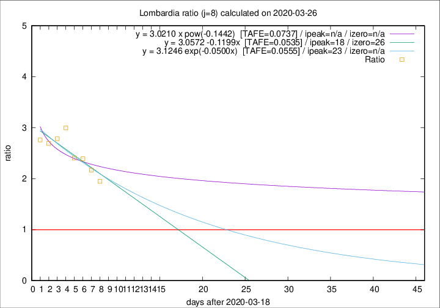

# Lombardia

Data source: https://raw.githubusercontent.com/pcm-dpc/COVID-19/master/dati-json/dpc-covid19-ita-regioni.json

Delta days analysis (j): 8

Analyses for other values of j for 2020-03-26 are avalable [here](../2020-03-26/README.md)

Analyses for Lombardia for previous dates are avalable [here](../README.md)

## Fitting 
|fit type|best fit equation|tafe|tfe|ipeak|izero|
|-------|-----|--------|------|---|---|
|linear|y = 3.0572 -0.1199x  [TAFE=0.0535]|0.0535|0.0052|18|26|
|exp|y = 3.1246 exp(-0.0500x)  [TAFE=0.0555]|0.0555|0.0024|23|n/a|
|pow|y = 3.0210 x pow(-0.1442)  [TAFE=0.0737]|0.0737|0.0046|n/a|n/a|

## Data
|Date|Daily deaths|Cumulated deaths|Deaths in the last 8 days|Deaths in the 8 days before|ratio|
|----|----------|-----------|-------|--------------------|-----|
|2020-03-26|387|4861|2902|1491|1.9463|
|2020-03-25|296|4474|2834|1307|2.1683|
|2020-03-24|402|4178|2758|1153|2.3920|
|2020-03-23|320|3776|2558|1064|2.4041|
|2020-03-22|361|3456|2490|831|2.9964|
|2020-03-21|546|3095|2205|792|2.7841|
|2020-03-20|381|2549|1805|671|2.6900|
|2020-03-19|209|2168|1551|562|2.7598|

[Download data as CSV](COVID-19_lombardia_j8_2020-03-26.csv)

Generated April 16th, 2020 at 20:09:19 UTC+0200 with https://github.com/robianc/COVID-19
