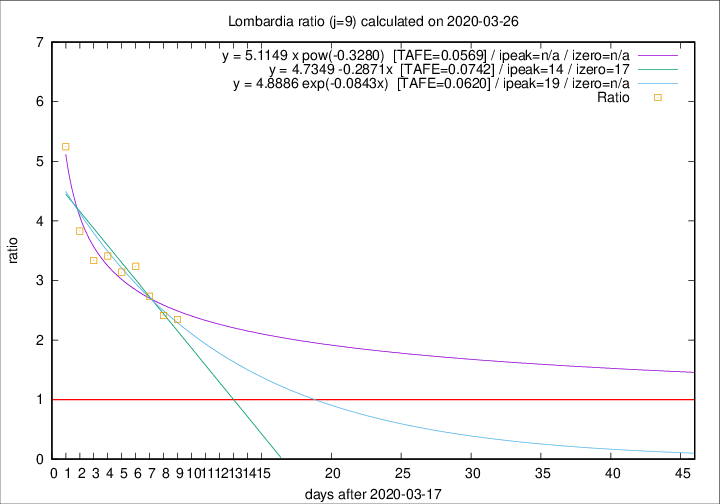

# Lombardia

Data source: https://raw.githubusercontent.com/pcm-dpc/COVID-19/master/dati-json/dpc-covid19-ita-regioni.json

Delta days analysis (j): 9

Analyses for other values of j for 2020-03-26 are avalable [here](../README.md)

Analyses for Lombardia for previous dates are avalable [here](../../README.md)

## Fitting 
|fit type|best fit equation|tafe|tfe|ipeak|izero|
|-------|-----|--------|------|---|---|
|linear|y = 4.7349 -0.2871x  [TAFE=0.0742]|0.0742|0.0058|14|17|
|exp|y = 4.8886 exp(-0.0843x)  [TAFE=0.0620]|0.0620|0.0030|19|n/a|
|pow|y = 5.1149 x pow(-0.3280)  [TAFE=0.0569]|0.0569|0.0021|n/a|n/a|

## Data
|Date|Daily deaths|Cumulated deaths|Deaths in the last 9 days|Deaths in the 9 days before|ratio|
|----|----------|-----------|-------|--------------------|-----|
|2020-03-26|387|4861|3221|1373|2.3460|
|2020-03-25|296|4474|3054|1266|2.4123|
|2020-03-24|402|4178|2960|1083|2.7331|
|2020-03-23|320|3776|2810|868|3.2373|
|2020-03-22|361|3456|2566|817|3.1408|
|2020-03-21|546|3095|2351|689|3.4122|
|2020-03-20|381|2549|1932|579|3.3368|
|2020-03-19|209|2168|1700|444|3.8288|
|2020-03-18|319|1959|1626|310|5.2452|

[Download data as CSV](COVID-19_lombardia_j9_2020-03-26.csv)

Generated April 12th, 2020 at 16:28:18 UTC+0200 with https://github.com/robianc/COVID-19
