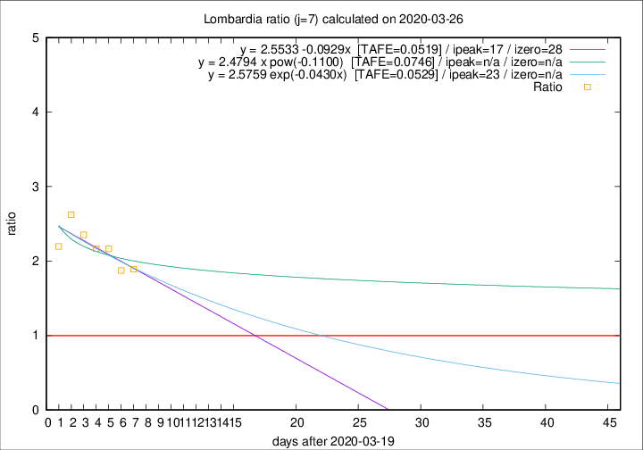

# Lombardia

Data source: https://raw.githubusercontent.com/pcm-dpc/COVID-19/master/dati-json/dpc-covid19-ita-regioni.json

Estimates in this page were made on 14/4/2020 with data available until 26/03/2020.

## Summary 

### Peak estimate 
|j|linear [TAFE]|exponential [TAFE]|power law [TAFE]|details|
|---|----|-----------|---------|-------|
|7|6/4/2020 [TAFE=0.0519]|12/4/2020 [TAFE=0.0529]|-|[analysis](COVID-19_lombardia_j7_2020-03-26.md)|
|8|6/4/2020 [TAFE=0.0535]|11/4/2020 [TAFE=0.0555]|-|[analysis](COVID-19_lombardia_j8_2020-03-26.md)|
|9|1/4/2020 [TAFE=0.0742]|6/4/2020 [TAFE=0.0620]|-|[analysis](COVID-19_lombardia_j9_2020-03-26.md)|
|10|29/3/2020 [TAFE=0.1751]|4/4/2020 [TAFE=0.0950]|23/5/2020 [TAFE=0.0331]|[analysis](COVID-19_lombardia_j10_2020-03-26.md)|
|11|-|-|-||
|12|-|-|-||
|13|-|-|-||
|14|-|-|-||

Best estimator is pow with j=10 (TAFE=0.0331)
Corresponding peak date estimate is 23/5/2020 (ipeak 67)

Peak date range estimate: 17/3/2020 - 23/5/2020

### End estimate 
|j|linear [TAFE/TFE]|exponential [TAFE/TFE]|power law [TAFE/TFE]|details|
|---|----|-----------|---------|-------|
|7|17/4/2020 [TAFE=0.0519]|-|-|[analysis](COVID-19_lombardia_j7_2020-03-26.md)|
|8|-|-|-|[analysis](COVID-19_lombardia_j8_2020-03-26.md)|
|9|-|-|-|[analysis](COVID-19_lombardia_j9_2020-03-26.md)|
|10|-|-|-|[analysis](COVID-19_lombardia_j10_2020-03-26.md)|
|11|-|-|-||
|12|-|-|-||
|13|-|-|-||
|14|-|-|-||

Best estimator is linear with j=7 (TAFE=0.0519)
Corresponding end date estimate is 17/4/2020 (izero 28)

End date range estimate: 20/3/2020 - 17/4/2020

Generated April 14th, 2020 at 19:16:04 UTC+0200 with https://github.com/robianc/COVID-19
