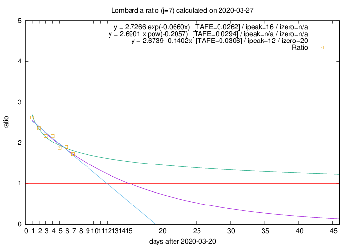
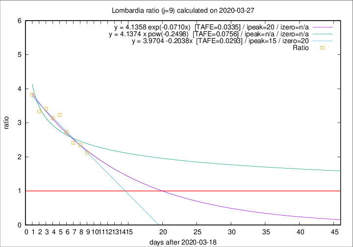

# Lombardia

Data source: https://raw.githubusercontent.com/pcm-dpc/COVID-19/master/dati-json/dpc-covid19-ita-regioni.json

Estimates in this page were made on 10/4/2020 with data available until 27/03/2020.

## Summary 

### Peak estimate 
|j|linear [TAFE]|exponential [TAFE]|power law [TAFE]|details|
|---|----|-----------|---------|-------|
|7|2/4/2020 [TAFE=0.0306]|6/4/2020 [TAFE=0.0262]|-|[analysis](COVID-19_lombardia_j7_2020-03-27.md)|
|8|5/4/2020 [TAFE=0.0527]|10/4/2020 [TAFE=0.0523]|-|[analysis](COVID-19_lombardia_j8_2020-03-27.md)|
|9|3/4/2020 [TAFE=0.0293]|8/4/2020 [TAFE=0.0335]|-|[analysis](COVID-19_lombardia_j9_2020-03-27.md)|
|10|31/3/2020 [TAFE=0.0870]|6/4/2020 [TAFE=0.0537]|-|[analysis](COVID-19_lombardia_j10_2020-03-27.md)|
|11|29/3/2020 [TAFE=0.2057]|4/4/2020 [TAFE=0.0975]|28/5/2020 [TAFE=0.0892]|[analysis](COVID-19_lombardia_j11_2020-03-27.md)|
|12|-|-|-||
|13|-|-|-||
|14|-|-|-||

Best estimator is exp with j=7 (TAFE=0.0262)
Corresponding peak date estimate is 6/4/2020 (ipeak 16)

Peak date range estimate: 21/3/2020 - 1/6/2020

### End estimate 
|j|linear [TAFE/TFE]|exponential [TAFE/TFE]|power law [TAFE/TFE]|details|
|---|----|-----------|---------|-------|
|7|10/4/2020 [TAFE=0.0306]|-|-|[analysis](COVID-19_lombardia_j7_2020-03-27.md)|
|8|-|-|-|[analysis](COVID-19_lombardia_j8_2020-03-27.md)|
|9|8/4/2020 [TAFE=0.0293]|-|-|[analysis](COVID-19_lombardia_j9_2020-03-27.md)|
|10|-|-|-|[analysis](COVID-19_lombardia_j10_2020-03-27.md)|
|11|-|-|-|[analysis](COVID-19_lombardia_j11_2020-03-27.md)|
|12|-|-|-||
|13|-|-|-||
|14|-|-|-||

Best estimator is linear with j=9 (TAFE=0.0293)
Corresponding end date estimate is 8/4/2020 (izero 20)

End date range estimate: 19/3/2020 - 12/4/2020

Generated April 10th, 2020 at 17:26:10 UTC+0200 with https://github.com/robianc/COVID-19
