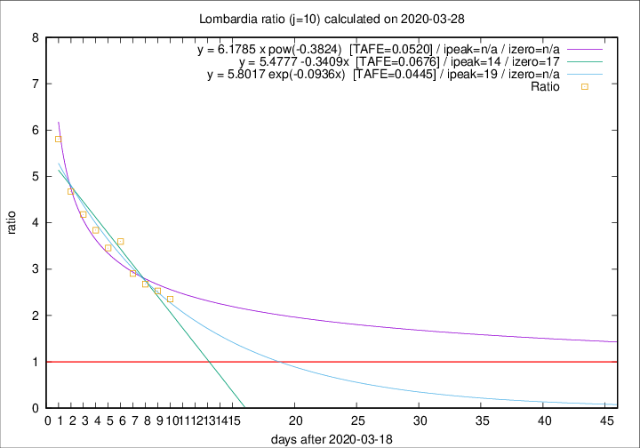

# Lombardia

Data source: https://raw.githubusercontent.com/pcm-dpc/COVID-19/master/dati-json/dpc-covid19-ita-regioni.json

Delta days analysis (j): 10

Analyses for other values of j for 2020-03-28 are avalable [here](../2020-03-28/README.md)

Analyses for Lombardia for previous dates are avalable [here](../README.md)

## Fitting 
|fit type|best fit equation|tafe|tfe|ipeak|izero|
|-------|-----|--------|------|---|---|
|linear|y = 5.4777 -0.3409x  [TAFE=0.0676]|0.0676|0.0014|14|17|
|exp|y = 5.8017 exp(-0.0936x)  [TAFE=0.0445]|0.0445|0.0011|19|n/a|
|pow|y = 6.1785 x pow(-0.3824)  [TAFE=0.0520]|0.0520|0.0020|n/a|n/a|

## Data
|Date|Daily deaths|Cumulated deaths|Deaths in the last 10 days|Deaths in the 10 days before|ratio|
|----|----------|-----------|-------|--------------------|-----|
|2020-03-28|542|5944|3985|1692|2.3552|
|2020-03-27|541|5402|3762|1486|2.5316|
|2020-03-26|387|4861|3441|1285|2.6778|
|2020-03-25|296|4474|3256|1120|2.9071|
|2020-03-24|402|4178|3212|893|3.5969|
|2020-03-23|320|3776|2886|835|3.4563|
|2020-03-22|361|3456|2712|706|3.8414|
|2020-03-21|546|3095|2478|593|4.1788|
|2020-03-20|381|2549|2081|445|4.6764|
|2020-03-19|209|2168|1835|316|5.8070|

[Download data as CSV](COVID-19_lombardia_j10_2020-03-28.csv)

Generated April 16th, 2020 at 20:09:19 UTC+0200 with https://github.com/robianc/COVID-19
