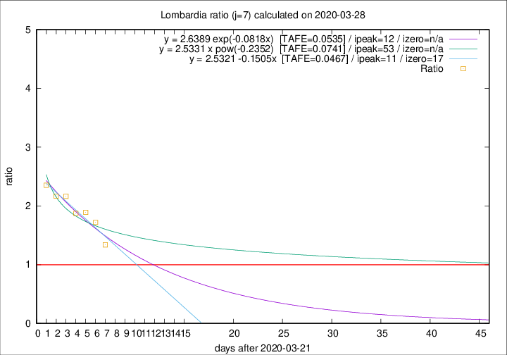

# Lombardia

Data source: https://raw.githubusercontent.com/pcm-dpc/COVID-19/master/dati-json/dpc-covid19-ita-regioni.json

Delta days analysis (j): 7

Analyses for other values of j for 2020-03-28 are avalable [here](../2020-03-28/README.md)

Analyses for Lombardia for previous dates are avalable [here](../README.md)

## Fitting 
|fit type|best fit equation|tafe|tfe|ipeak|izero|
|-------|-----|--------|------|---|---|
|linear|y = 2.5321 -0.1505x  [TAFE=0.0467]|0.0467|0.0036|11|17|
|exp|y = 2.6389 exp(-0.0818x)  [TAFE=0.0535]|0.0535|0.0020|12|n/a|
|pow|y = 2.5331 x pow(-0.2352)  [TAFE=0.0741]|0.0741|0.0043|53|n/a|

## Data
|Date|Daily deaths|Cumulated deaths|Deaths in the last 7 days|Deaths in the 7 days before|ratio|
|----|----------|-----------|-------|--------------------|-----|
|2020-03-28|542|5944|2849|2129|1.3382|
|2020-03-27|541|5402|2853|1659|1.7197|
|2020-03-26|387|4861|2693|1424|1.8912|
|2020-03-25|296|4474|2515|1342|1.8741|
|2020-03-24|402|4178|2538|1172|2.1655|
|2020-03-23|320|3776|2356|1087|2.1674|
|2020-03-22|361|3456|2238|951|2.3533|

[Download data as CSV](COVID-19_lombardia_j7_2020-03-28.csv)

Generated April 16th, 2020 at 20:09:19 UTC+0200 with https://github.com/robianc/COVID-19
