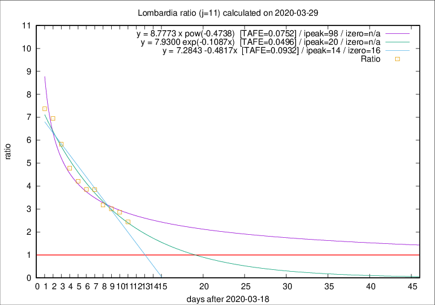

# Lombardia

Data source: https://raw.githubusercontent.com/pcm-dpc/COVID-19/master/dati-json/dpc-covid19-ita-regioni.json

Delta days analysis (j): 11

Analyses for other values of j for 2020-03-29 are avalable [here](../README.md)

Analyses for Lombardia for previous dates are avalable [here](../../README.md)

## Fitting 
|fit type|best fit equation|tafe|tfe|ipeak|izero|
|-------|-----|--------|------|---|---|
|linear|y = 7.2843 -0.4817x  [TAFE=0.0932]|0.0932|0.0003|14|16|
|exp|y = 7.9300 exp(-0.1087x)  [TAFE=0.0496]|0.0496|0.0018|20|n/a|
|pow|y = 8.7773 x pow(-0.4738)  [TAFE=0.0752]|0.0752|0.0042|98|n/a|

## Data
|Date|Daily deaths|Cumulated deaths|Deaths in the last 11 days|Deaths in the 11 days before|ratio|
|----|----------|-----------|-------|--------------------|-----|
|2020-03-29|416|6360|4401|1805|2.4382|
|2020-03-28|542|5944|4304|1505|2.8598|
|2020-03-27|541|5402|3982|1322|3.0121|
|2020-03-26|387|4861|3643|1145|3.1817|
|2020-03-25|296|4474|3508|911|3.8507|
|2020-03-24|402|4178|3288|852|3.8592|
|2020-03-23|320|3776|3032|720|4.2111|
|2020-03-22|361|3456|2839|594|4.7795|
|2020-03-21|546|3095|2627|451|5.8248|
|2020-03-20|381|2549|2216|319|6.9467|
|2020-03-19|209|2168|1901|258|7.3682|

[Download data as CSV](COVID-19_lombardia_j11_2020-03-29.csv)

Generated April 12th, 2020 at 16:28:18 UTC+0200 with https://github.com/robianc/COVID-19
