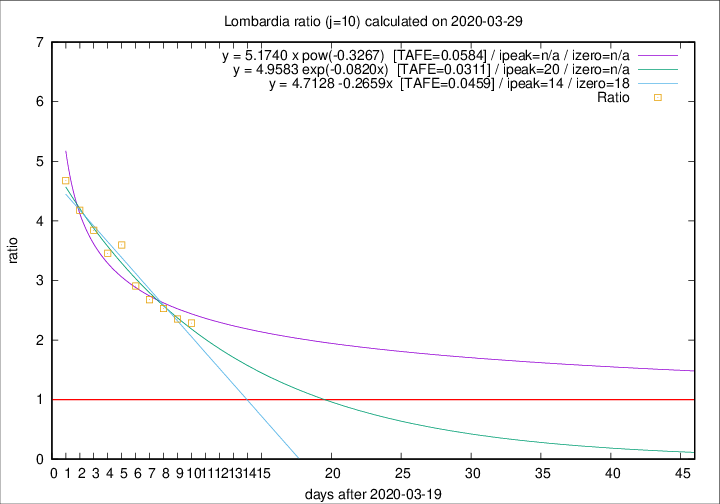

# Lombardia

Data source: https://raw.githubusercontent.com/pcm-dpc/COVID-19/master/dati-json/dpc-covid19-ita-regioni.json

Estimates in this page were made on 9/4/2020 with data available until 29/03/2020.

## Summary 

### Peak estimate 
|j|linear [TAFE]|exponential [TAFE]|power law [TAFE]|details|
|---|----|-----------|---------|-------|
|7|1/4/2020 [TAFE=0.0460]|3/4/2020 [TAFE=0.0530]|20/4/2020 [TAFE=0.0937]|[analysis](COVID-19_lombardia_j7_2020-03-29.md)|
|8|3/4/2020 [TAFE=0.0623]|6/4/2020 [TAFE=0.0591]|22/5/2020 [TAFE=0.0607]|[analysis](COVID-19_lombardia_j8_2020-03-29.md)|
|9|4/4/2020 [TAFE=0.0483]|9/4/2020 [TAFE=0.0369]|-|[analysis](COVID-19_lombardia_j9_2020-03-29.md)|
|10|3/4/2020 [TAFE=0.0459]|9/4/2020 [TAFE=0.0311]|-|[analysis](COVID-19_lombardia_j10_2020-03-29.md)|
|11|2/4/2020 [TAFE=0.0932]|8/4/2020 [TAFE=0.0496]|25/6/2020 [TAFE=0.0752]|[analysis](COVID-19_lombardia_j11_2020-03-29.md)|
|12|-|-|-||
|13|-|-|-||
|14|-|-|-||

Best estimator is exp with j=10 (TAFE=0.0311)
Corresponding peak date estimate is 9/4/2020 (ipeak 20)

Peak date range estimate: 20/3/2020 - 26/6/2020

### End estimate 
|j|linear [TAFE/TFE]|exponential [TAFE/TFE]|power law [TAFE/TFE]|details|
|---|----|-----------|---------|-------|
|7|8/4/2020 [TAFE=0.0460]|-|-|[analysis](COVID-19_lombardia_j7_2020-03-29.md)|
|8|-|-|-|[analysis](COVID-19_lombardia_j8_2020-03-29.md)|
|9|-|-|-|[analysis](COVID-19_lombardia_j9_2020-03-29.md)|
|10|7/4/2020 [TAFE=0.0459]|-|-|[analysis](COVID-19_lombardia_j10_2020-03-29.md)|
|11|-|-|-|[analysis](COVID-19_lombardia_j11_2020-03-29.md)|
|12|-|-|-||
|13|-|-|-||
|14|-|-|-||

Best estimator is linear with j=10 (TAFE=0.0459)
Corresponding end date estimate is 7/4/2020 (izero 18)

End date range estimate: 20/3/2020 - 9/4/2020

Generated April 9th, 2020 at 16:40:48 UTC+0200 with https://github.com/robianc/COVID-19
