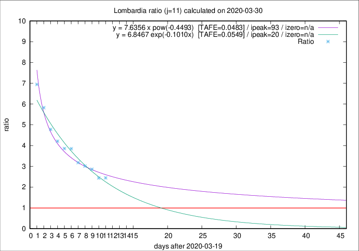

# Lombardia

Data source: https://raw.githubusercontent.com/pcm-dpc/COVID-19/master/dati-json/dpc-covid19-ita-regioni.json

Delta days analysis (j): 11

Analyses for other values of j for 2020-03-30 are avalable [here](../2020-03-30/README.md)

Analyses for Lombardia for previous dates are avalable [here](../README.md)

## Fitting 
|fit type|best fit equation|tafe|tfe|ipeak|izero|
|-------|-----|--------|------|---|---|
|exp|y = 6.8467 exp(-0.1010x)  [TAFE=0.0549]|0.0549|0.0017|20|n/a|
|pow|y = 7.6356 x pow(-0.4493)  [TAFE=0.0483]|0.0483|0.0019|93|n/a|

## Data
|Date|Daily deaths|Cumulated deaths|Deaths in the last 11 days|Deaths in the 11 days before|ratio|
|----|----------|-----------|-------|--------------------|-----|
|2020-03-30|458|6818|4650|1901|2.4461|
|2020-03-29|416|6360|4401|1805|2.4382|
|2020-03-28|542|5944|4304|1505|2.8598|
|2020-03-27|541|5402|3982|1322|3.0121|
|2020-03-26|387|4861|3643|1145|3.1817|
|2020-03-25|296|4474|3508|911|3.8507|
|2020-03-24|402|4178|3288|852|3.8592|
|2020-03-23|320|3776|3032|720|4.2111|
|2020-03-22|361|3456|2839|594|4.7795|
|2020-03-21|546|3095|2627|451|5.8248|
|2020-03-20|381|2549|2216|319|6.9467|

[Download data as CSV](COVID-19_lombardia_j11_2020-03-30.csv)

Generated April 14th, 2020 at 19:16:04 UTC+0200 with https://github.com/robianc/COVID-19
