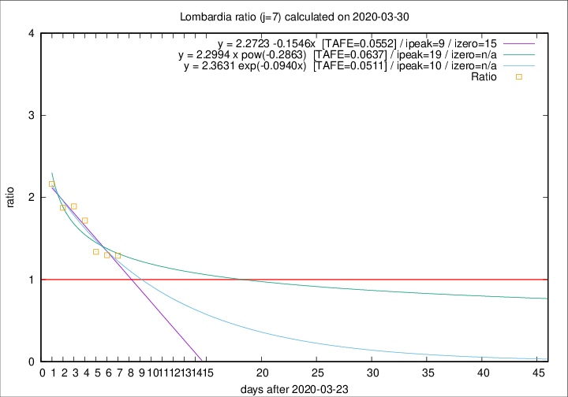

# Lombardia

Data source: https://raw.githubusercontent.com/pcm-dpc/COVID-19/master/dati-json/dpc-covid19-ita-regioni.json

Delta days analysis (j): 7

## Fitting 
|fit type|best fit equation|tafe|tfe|ipeak|izero|
|-------|-----|--------|------|---|---|
|linear|y = 2.2723 -0.1546x  [TAFE=0.0552]|0.0552|0.0031|9|15|
|exp|y = 2.3631 exp(-0.0940x)  [TAFE=0.0511]|0.0511|0.0017|10|n/a|
|pow|y = 2.2994 x pow(-0.2863)  [TAFE=0.0637]|0.0637|0.0028|19|n/a|

## Data
|Date|Daily deaths|Cumulated deaths|Deaths in the last 7 days|Deaths in the 7 days before|ratio|
|----|----------|-----------|-------|--------------------|-----|
|2020-03-30|458|6818|3042|2356|1.2912|
|2020-03-29|416|6360|2904|2238|1.2976|
|2020-03-28|542|5944|2849|2129|1.3382|
|2020-03-27|541|5402|2853|1659|1.7197|
|2020-03-26|387|4861|2693|1424|1.8912|
|2020-03-25|296|4474|2515|1342|1.8741|
|2020-03-24|402|4178|2538|1172|2.1655|

[Download data as CSV](COVID-19_lombardia_j7_2020-03-30.csv)

Generated April 8th, 2020 at 23:43:36 UTC+0200 with https://github.com/robianc/COVID-19
