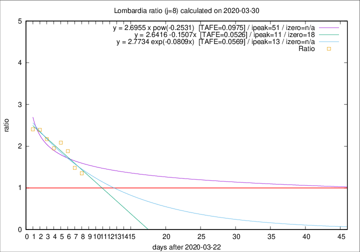

# Lombardia

Data source: https://raw.githubusercontent.com/pcm-dpc/COVID-19/master/dati-json/dpc-covid19-ita-regioni.json

Delta days analysis (j): 8

Analyses for other values of j for 2020-03-30 are avalable [here](../2020-03-30/README.md)

Analyses for Lombardia for previous dates are avalable [here](../README.md)

## Fitting 
|fit type|best fit equation|tafe|tfe|ipeak|izero|
|-------|-----|--------|------|---|---|
|linear|y = 2.6416 -0.1507x  [TAFE=0.0526]|0.0526|0.0045|11|18|
|exp|y = 2.7734 exp(-0.0809x)  [TAFE=0.0569]|0.0569|0.0023|13|n/a|
|pow|y = 2.6955 x pow(-0.2531)  [TAFE=0.0975]|0.0975|0.0057|51|n/a|

## Data
|Date|Daily deaths|Cumulated deaths|Deaths in the last 8 days|Deaths in the 8 days before|ratio|
|----|----------|-----------|-------|--------------------|-----|
|2020-03-30|458|6818|3362|2490|1.3502|
|2020-03-29|416|6360|3265|2205|1.4807|
|2020-03-28|542|5944|3395|1805|1.8809|
|2020-03-27|541|5402|3234|1551|2.0851|
|2020-03-26|387|4861|2902|1491|1.9463|
|2020-03-25|296|4474|2834|1307|2.1683|
|2020-03-24|402|4178|2758|1153|2.3920|
|2020-03-23|320|3776|2558|1064|2.4041|

[Download data as CSV](COVID-19_lombardia_j8_2020-03-30.csv)

Generated April 14th, 2020 at 19:16:04 UTC+0200 with https://github.com/robianc/COVID-19
