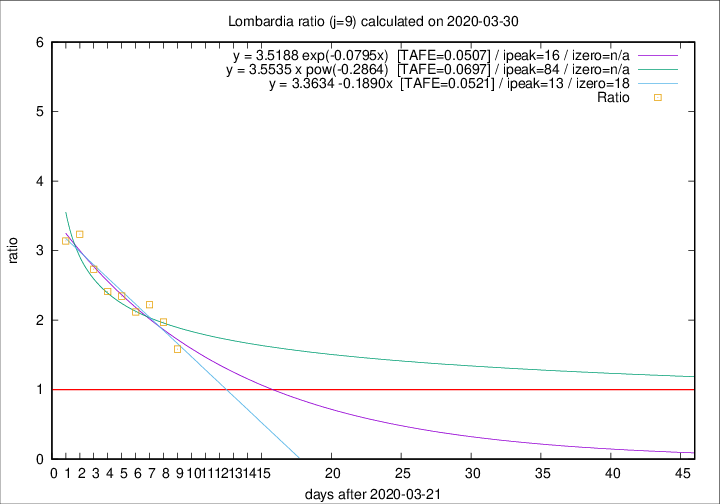

# Lombardia

Data source: https://raw.githubusercontent.com/pcm-dpc/COVID-19/master/dati-json/dpc-covid19-ita-regioni.json

Delta days analysis (j): 9

## Fitting 
|fit type|best fit equation|tafe|tfe|ipeak|izero|
|-------|-----|--------|------|---|---|
|linear|y = 3.3634 -0.1890x  [TAFE=0.0521]|0.0521|0.0031|13|18|
|exp|y = 3.5188 exp(-0.0795x)  [TAFE=0.0507]|0.0507|0.0018|16|n/a|
|pow|y = 3.5535 x pow(-0.2864)  [TAFE=0.0697]|0.0697|0.0040|84|n/a|

## Data
|Date|Daily deaths|Cumulated deaths|Deaths in the last 9 days|Deaths in the 9 days before|ratio|
|----|----------|-----------|-------|--------------------|-----|
|2020-03-30|458|6818|3723|2351|1.5836|
|2020-03-29|416|6360|3811|1932|1.9726|
|2020-03-28|542|5944|3776|1700|2.2212|
|2020-03-27|541|5402|3443|1626|2.1175|
|2020-03-26|387|4861|3221|1373|2.3460|
|2020-03-25|296|4474|3054|1266|2.4123|
|2020-03-24|402|4178|2960|1083|2.7331|
|2020-03-23|320|3776|2810|868|3.2373|
|2020-03-22|361|3456|2566|817|3.1408|

[Download data as CSV](COVID-19_lombardia_j9_2020-03-30.csv)

Generated April 8th, 2020 at 23:43:36 UTC+0200 with https://github.com/robianc/COVID-19
