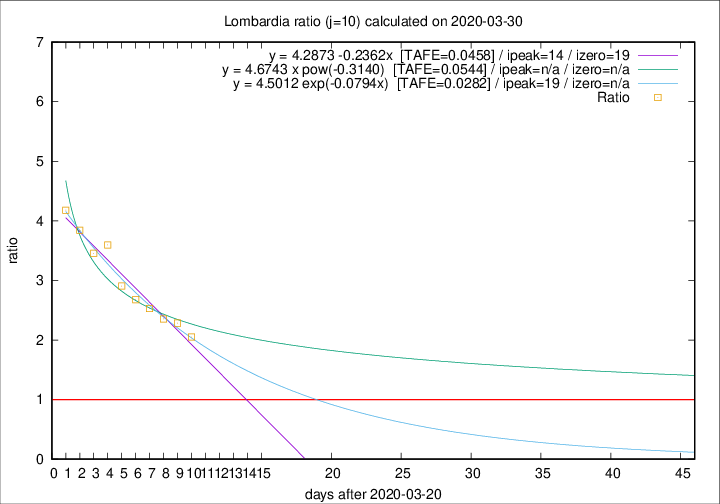

# Lombardia

Data source: https://raw.githubusercontent.com/pcm-dpc/COVID-19/master/dati-json/dpc-covid19-ita-regioni.json

Estimates in this page were made on 8/4/2020 with data available until 30/03/2020.

## Summary 

### Peak estimate 
|j|linear [TAFE]|exponential [TAFE]|power law [TAFE]|details|
|---|----|-----------|---------|-------|
|7|2/4/2020 [TAFE=0.0552]|3/4/2020 [TAFE=0.0511]|12/4/2020 [TAFE=0.0637]|[analysis](COVID-19_lombardia_j7_2020-03-30.md)|
|8|3/4/2020 [TAFE=0.0526]|5/4/2020 [TAFE=0.0569]|13/5/2020 [TAFE=0.0975]|[analysis](COVID-19_lombardia_j8_2020-03-30.md)|
|9|4/4/2020 [TAFE=0.0521]|7/4/2020 [TAFE=0.0507]|14/6/2020 [TAFE=0.0697]|[analysis](COVID-19_lombardia_j9_2020-03-30.md)|
|10|4/4/2020 [TAFE=0.0458]|9/4/2020 [TAFE=0.0282]|-|[analysis](COVID-19_lombardia_j10_2020-03-30.md)|
|11|3/4/2020 [TAFE=0.0925]|9/4/2020 [TAFE=0.0549]|21/6/2020 [TAFE=0.0483]|[analysis](COVID-19_lombardia_j11_2020-03-30.md)|
|12|1/4/2020 [TAFE=0.2001]|7/4/2020 [TAFE=0.0912]|25/5/2020 [TAFE=0.0550]|[analysis](COVID-19_lombardia_j12_2020-03-30.md)|
|13|-|-|-||
|14|-|-|-||

Best estimator is exp with j=10 (TAFE=0.0282)
Corresponding peak date estimate is 9/4/2020 (ipeak 19)

Peak date range estimate: 21/3/2020 - 22/6/2020

### End estimate 
|j|linear [TAFE/TFE]|exponential [TAFE/TFE]|power law [TAFE/TFE]|details|
|---|----|-----------|---------|-------|
|7|8/4/2020 [TAFE=0.0552]|-|-|[analysis](COVID-19_lombardia_j7_2020-03-30.md)|
|8|10/4/2020 [TAFE=0.0526]|-|-|[analysis](COVID-19_lombardia_j8_2020-03-30.md)|
|9|9/4/2020 [TAFE=0.0521]|-|-|[analysis](COVID-19_lombardia_j9_2020-03-30.md)|
|10|9/4/2020 [TAFE=0.0458]|-|-|[analysis](COVID-19_lombardia_j10_2020-03-30.md)|
|11|-|-|-|[analysis](COVID-19_lombardia_j11_2020-03-30.md)|
|12|-|-|-|[analysis](COVID-19_lombardia_j12_2020-03-30.md)|
|13|-|-|-||
|14|-|-|-||

Best estimator is linear with j=10 (TAFE=0.0458)
Corresponding end date estimate is 9/4/2020 (izero 19)

End date range estimate: 21/3/2020 - 9/4/2020

Generated April 8th, 2020 at 23:43:36 UTC+0200 with https://github.com/robianc/COVID-19
