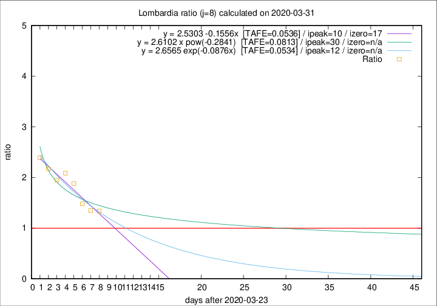

# Lombardia

Data source: https://raw.githubusercontent.com/pcm-dpc/COVID-19/master/dati-json/dpc-covid19-ita-regioni.json

Delta days analysis (j): 8

## Fitting 
|fit type|best fit equation|tafe|tfe|ipeak|izero|
|-------|-----|--------|------|---|---|
|linear|y = 2.5303 -0.1556x  [TAFE=0.0536]|0.0536|0.0037|10|17|
|exp|y = 2.6565 exp(-0.0876x)  [TAFE=0.0534]|0.0534|0.0019|12|n/a|
|pow|y = 2.6102 x pow(-0.2841)  [TAFE=0.0813]|0.0813|0.0045|30|n/a|

## Data
|Date|Daily deaths|Cumulated deaths|Deaths in the last 8 days|Deaths in the 8 days before|ratio|
|----|----------|-----------|-------|--------------------|-----|
|2020-03-31|381|7199|3423|2558|1.3382|
|2020-03-30|458|6818|3362|2490|1.3502|
|2020-03-29|416|6360|3265|2205|1.4807|
|2020-03-28|542|5944|3395|1805|1.8809|
|2020-03-27|541|5402|3234|1551|2.0851|
|2020-03-26|387|4861|2902|1491|1.9463|
|2020-03-25|296|4474|2834|1307|2.1683|
|2020-03-24|402|4178|2758|1153|2.3920|

[Download data as CSV](COVID-19_lombardia_j8_2020-03-31.csv)

Generated April 8th, 2020 at 23:43:36 UTC+0200 with https://github.com/robianc/COVID-19
