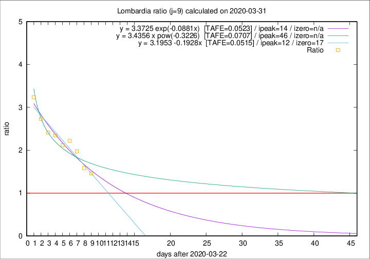

# Lombardia

Data source: https://raw.githubusercontent.com/pcm-dpc/COVID-19/master/dati-json/dpc-covid19-ita-regioni.json

Delta days analysis (j): 9

Analyses for other values of j for 2020-03-31 are avalable [here](../2020-03-31/README.md)

Analyses for Lombardia for previous dates are avalable [here](../README.md)

## Fitting 
|fit type|best fit equation|tafe|tfe|ipeak|izero|
|-------|-----|--------|------|---|---|
|linear|y = 3.1953 -0.1928x  [TAFE=0.0515]|0.0515|0.0028|12|17|
|exp|y = 3.3725 exp(-0.0881x)  [TAFE=0.0523]|0.0523|0.0016|14|n/a|
|pow|y = 3.4356 x pow(-0.3226)  [TAFE=0.0707]|0.0707|0.0037|46|n/a|

## Data
|Date|Daily deaths|Cumulated deaths|Deaths in the last 9 days|Deaths in the 9 days before|ratio|
|----|----------|-----------|-------|--------------------|-----|
|2020-03-31|381|7199|3743|2566|1.4587|
|2020-03-30|458|6818|3723|2351|1.5836|
|2020-03-29|416|6360|3811|1932|1.9726|
|2020-03-28|542|5944|3776|1700|2.2212|
|2020-03-27|541|5402|3443|1626|2.1175|
|2020-03-26|387|4861|3221|1373|2.3460|
|2020-03-25|296|4474|3054|1266|2.4123|
|2020-03-24|402|4178|2960|1083|2.7331|
|2020-03-23|320|3776|2810|868|3.2373|

[Download data as CSV](COVID-19_lombardia_j9_2020-03-31.csv)

Generated April 19th, 2020 at 18:42:39 UTC+0200 with https://github.com/robianc/COVID-19
