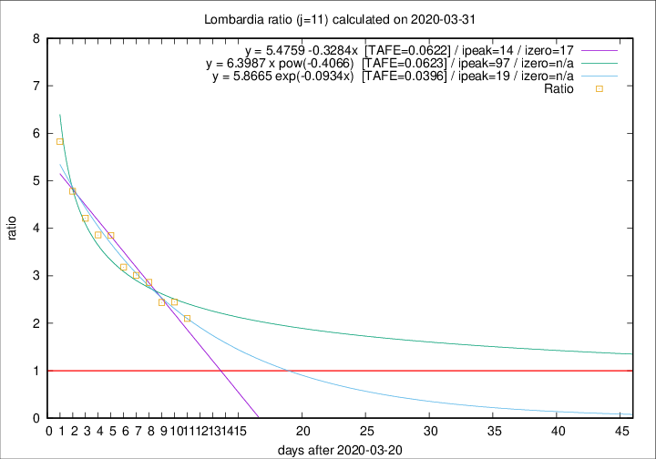
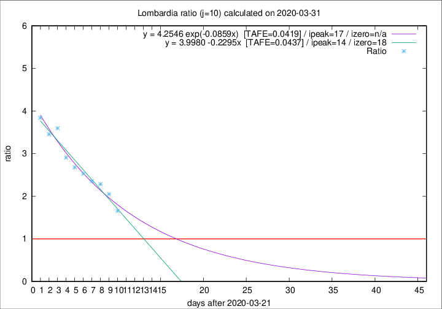

# Lombardia

Data source: https://raw.githubusercontent.com/pcm-dpc/COVID-19/master/dati-json/dpc-covid19-ita-regioni.json

Estimates in this page were made on 12/4/2020 with data available until 31/03/2020.

## Summary 

### Peak estimate 
|j|linear [TAFE]|exponential [TAFE]|power law [TAFE]|details|
|---|----|-----------|---------|-------|
|7|2/4/2020 [TAFE=0.0583]|3/4/2020 [TAFE=0.0540]|10/4/2020 [TAFE=0.0627]|[analysis](COVID-19_lombardia_j7_2020-03-31.md)|
|8|3/4/2020 [TAFE=0.0536]|5/4/2020 [TAFE=0.0534]|23/4/2020 [TAFE=0.0813]|[analysis](COVID-19_lombardia_j8_2020-03-31.md)|
|9|4/4/2020 [TAFE=0.0515]|6/4/2020 [TAFE=0.0523]|8/5/2020 [TAFE=0.0707]|[analysis](COVID-19_lombardia_j9_2020-03-31.md)|
|10|5/4/2020 [TAFE=0.0437]|8/4/2020 [TAFE=0.0419]|15/6/2020 [TAFE=0.0765]|[analysis](COVID-19_lombardia_j10_2020-03-31.md)|
|11|4/4/2020 [TAFE=0.0622]|9/4/2020 [TAFE=0.0396]|26/6/2020 [TAFE=0.0623]|[analysis](COVID-19_lombardia_j11_2020-03-31.md)|
|12|3/4/2020 [TAFE=0.1319]|9/4/2020 [TAFE=0.0588]|10/6/2020 [TAFE=0.0768]|[analysis](COVID-19_lombardia_j12_2020-03-31.md)|
|13|-|-|-||
|14|-|-|-||

Best estimator is exp with j=11 (TAFE=0.0396)
Corresponding peak date estimate is 9/4/2020 (ipeak 19)

Peak date range estimate: 21/3/2020 - 26/6/2020

### End estimate 
|j|linear [TAFE/TFE]|exponential [TAFE/TFE]|power law [TAFE/TFE]|details|
|---|----|-----------|---------|-------|
|7|10/4/2020 [TAFE=0.0583]|-|-|[analysis](COVID-19_lombardia_j7_2020-03-31.md)|
|8|10/4/2020 [TAFE=0.0536]|-|-|[analysis](COVID-19_lombardia_j8_2020-03-31.md)|
|9|9/4/2020 [TAFE=0.0515]|-|-|[analysis](COVID-19_lombardia_j9_2020-03-31.md)|
|10|9/4/2020 [TAFE=0.0437]|-|-|[analysis](COVID-19_lombardia_j10_2020-03-31.md)|
|11|-|-|-|[analysis](COVID-19_lombardia_j11_2020-03-31.md)|
|12|-|-|-|[analysis](COVID-19_lombardia_j12_2020-03-31.md)|
|13|-|-|-||
|14|-|-|-||

Best estimator is linear with j=10 (TAFE=0.0437)
Corresponding end date estimate is 9/4/2020 (izero 18)

End date range estimate: 22/3/2020 - 9/4/2020

Generated April 12th, 2020 at 16:28:18 UTC+0200 with https://github.com/robianc/COVID-19
