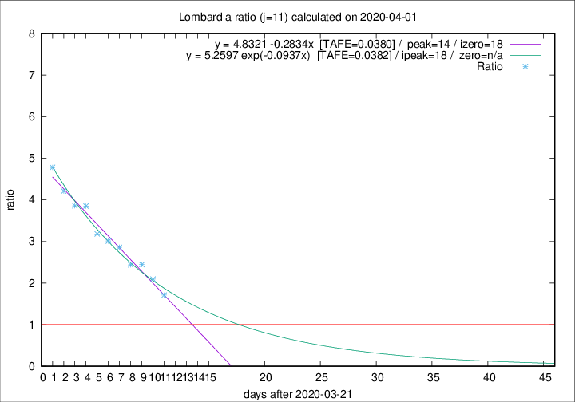

# Lombardia

Data source: https://raw.githubusercontent.com/pcm-dpc/COVID-19/master/dati-json/dpc-covid19-ita-regioni.json

Estimates in this page were made on 12/4/2020 with data available until 01/04/2020.

## Summary 

### Peak estimate 
|j|linear [TAFE]|exponential [TAFE]|power law [TAFE]|details|
|---|----|-----------|---------|-------|
|7|3/4/2020 [TAFE=0.0727]|4/4/2020 [TAFE=0.0662]|9/4/2020 [TAFE=0.0404]|[analysis](COVID-19_lombardia_j7_2020-04-01.md)|
|8|4/4/2020 [TAFE=0.0564]|5/4/2020 [TAFE=0.0544]|16/4/2020 [TAFE=0.0780]|[analysis](COVID-19_lombardia_j8_2020-04-01.md)|
|9|5/4/2020 [TAFE=0.0401]|6/4/2020 [TAFE=0.0455]|3/5/2020 [TAFE=0.0940]|[analysis](COVID-19_lombardia_j9_2020-04-01.md)|
|10|5/4/2020 [TAFE=0.0417]|8/4/2020 [TAFE=0.0480]|18/5/2020 [TAFE=0.1010]|[analysis](COVID-19_lombardia_j10_2020-04-01.md)|
|11|5/4/2020 [TAFE=0.0380]|9/4/2020 [TAFE=0.0382]|12/6/2020 [TAFE=0.0940]|[analysis](COVID-19_lombardia_j11_2020-04-01.md)|
|12|4/4/2020 [TAFE=0.1144]|9/4/2020 [TAFE=0.0524]|2/6/2020 [TAFE=0.0613]|[analysis](COVID-19_lombardia_j12_2020-04-01.md)|
|13|-|-|-||
|14|-|-|-||

Best estimator is linear with j=11 (TAFE=0.0380)
Corresponding peak date estimate is 5/4/2020 (ipeak 14)

Peak date range estimate: 22/3/2020 - 12/6/2020

### End estimate 
|j|linear [TAFE/TFE]|exponential [TAFE/TFE]|power law [TAFE/TFE]|details|
|---|----|-----------|---------|-------|
|7|13/4/2020 [TAFE=0.0727]|-|-|[analysis](COVID-19_lombardia_j7_2020-04-01.md)|
|8|11/4/2020 [TAFE=0.0564]|-|-|[analysis](COVID-19_lombardia_j8_2020-04-01.md)|
|9|11/4/2020 [TAFE=0.0401]|-|-|[analysis](COVID-19_lombardia_j9_2020-04-01.md)|
|10|-|-|-|[analysis](COVID-19_lombardia_j10_2020-04-01.md)|
|11|9/4/2020 [TAFE=0.0380]|-|-|[analysis](COVID-19_lombardia_j11_2020-04-01.md)|
|12|-|-|-|[analysis](COVID-19_lombardia_j12_2020-04-01.md)|
|13|-|-|-||
|14|-|-|-||

Best estimator is linear with j=11 (TAFE=0.0380)
Corresponding end date estimate is 9/4/2020 (izero 18)

End date range estimate: 22/3/2020 - 9/4/2020

Generated April 12th, 2020 at 16:28:18 UTC+0200 with https://github.com/robianc/COVID-19
